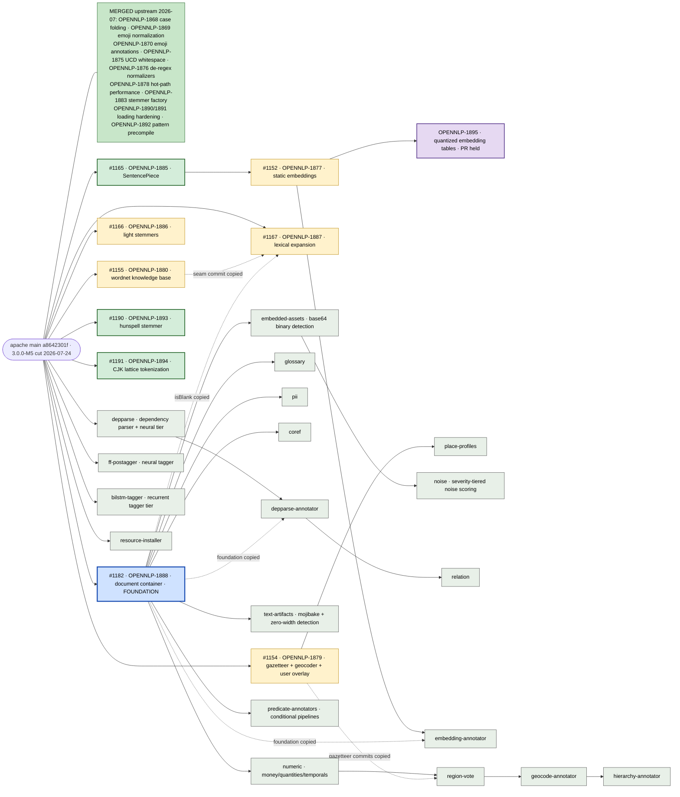

# Research branch map

This fork's layout: `main` mirrors `apache/opennlp` main exactly and never diverges, keeping the fork a clean base for upstream work; `kristian-3.x-features` is the research arm and the default branch, a regenerated integration line that merges every open pull request head and every admitted feature branch (each build records its exact inputs in `PIPESTREAM-PROVENANCE.txt`, and artifacts publish only as the `3.x-preview-SNAPSHOT` Maven snapshot); everything else is one feature per branch, stacked on its true dependency. Feature branches may be numerous and unvetted; a branch joins the research arm through a pull request based on `kristian-3.x-features`, whose merge adds it to the regeneration list. Nothing ever merges out of the research arm, and none of this touches the upstream project's own process. Read the warning at the top of [README.md](README.md) before using anything here. State below is as of 2026-07-24, measured against apache main `a8642301f`; the upstream project cut `opennlp-3.0.0-M5` that same morning and main carries on as `3.0.0-SNAPSHOT`.

## Merge strategy

Solid arrows are the verified git base of each branch. Dashed arrows are commits a branch carries as copies of another branch's work so it compiles standalone; the copies drop automatically (by patch id) when the parent lands and the branch rebases. Staged branches are renamed to their real JIRA keys before any upstream promotion.

Green nodes are pull requests marked ready for review upstream, amber are drafts, blue is the document container every annotator needs (open as a draft), purple is filed in JIRA with the pull request deliberately held, and pale green is staged in this fork only. `#1177` (OPENNLP-1870, emoji annotations) merged upstream on 2026-07-21 and has moved into the merged box; the EmojiFlags commits `geocode-annotator` carries as copies drop by patch id on its next rebase.

## Open pull requests against apache/opennlp

Every head below was rebased onto `a8642301f` on 2026-07-24, module-tested green, and force-pushed; all nine report mergeable. Status records the GitHub draft flag, which is the upstream project's review-queue signal and not a statement about whether the code is finished.

| PR | JIRA | What it offers | Status | Notes |
|---|---|---|---|---|
| [#1182](https://github.com/apache/opennlp/pull/1182) | OPENNLP-1888 | The document container: immutable `Document`, typed layers with positional/document scope, namespaced layer keys, adapters for the classic tools, manual chapter | Draft. The branch is review-ready; it sits as a draft because the upstream queue is not ready to take it, not because the work is unfinished. Rebased onto `a8642301f`, mergeable | The foundation every staged annotator below builds on |
| [#1166](https://github.com/apache/opennlp/pull/1166) | OPENNLP-1886 | Sixteen UniNE light/minimal stemmer tiers | Draft; rebased onto `a8642301f`, mergeable. That rebase dropped the 13 OPENNLP-1883 commits it used to carry, now that #1163 is upstream as one squash, leaving 3 commits of its own | Parity fixtures regenerated from the original implementations. Manual cites `LightStemmerUsageExampleTest` |
| [#1155](https://github.com/apache/opennlp/pull/1155) | OPENNLP-1880 | Lexical knowledge base seam with WN-LMF and WNDB readers and a Morphy lemmatizer | Draft; rebased onto `a8642301f`, mergeable | Manual: `wordnet.xml`, pinned by `WordNetUsageExampleTest` |
| [#1167](https://github.com/apache/opennlp/pull/1167) | OPENNLP-1887 | Weighted lexical expansion, synset similarity, hypernym-anchored typing | Draft, based on main and not on #1155: it carries the #1155 seam commit and #1182's `StringUtil.isBlank` as drop-on-rebase copies. Rebased onto `a8642301f`, which cleared the conflict it was reporting; mergeable | Manual expansion section cites `LexicalExpansionUsageExampleTest`. The branch has also grown clean-room morfologik CFSA2 and FSA5 readers plus a PoliMorf table lemmatizer, whose commits are titled `formats:`/`lemmatizer:` rather than with a JIRA key; decide whether they belong here or on their own ticket before promoting |
| [#1165](https://github.com/apache/opennlp/pull/1165) | OPENNLP-1885 | Pure-Java SentencePiece inference with exact original-text spans, plus a WordPiece encoder | Ready for review; rebased onto `a8642301f`, mergeable | 6.47M pieces/s single-thread on the T5-small vocabulary, 1.42x the C++ reference measured through its Python binding. Tokenizer manual cites `SentencePieceUsageExampleTest` |
| [#1152](https://github.com/apache/opennlp/pull/1152) | OPENNLP-1877 | Static text embeddings, pure JVM | Draft, stacked on #1165. Its base is the apache-hosted `sentencepiece` branch, which had diverged from the refreshed head and made the pull request read as conflicting; that base now tracks the head, so the diff is the 30 commits this change actually owns and it reports mergeable | 12.9x single-thread and about 7x peak throughput of the Python reference at 0.22x the memory (potion-base-8M, output parity asserted first). Manual cites `StaticEmbeddingUsageExampleTest` |
| [#1154](https://github.com/apache/opennlp/pull/1154) | OPENNLP-1879 | Gazetteer and geocoder seam, bundled Natural Earth table, GeoNames and Overture loaders, place hierarchy, user-supplied overlay (additions, suppressions, bounding boxes) | Draft; rebased onto `a8642301f`, mergeable | Bring-your-own-gazetteer reference in test sources. Geocoder section cites `GeocoderUsageExampleTest` |
| [#1190](https://github.com/apache/opennlp/pull/1190) | [OPENNLP-1893](https://issues.apache.org/jira/browse/OPENNLP-1893) | Hunspell `.dic`/`.aff` affix stemmer over user-supplied dictionaries, regex-free, fail-closed | Ready for review 2026-07-24; rebased onto `a8642301f`, mergeable | AF aliases, NEEDAFFIX / ONLYINCOMPOUND / FORBIDDENWORD / CIRCUMFIX, compound positioning incl. German linking forms. Manual: `stemmer.xml`, pinned by `HunspellManualExampleTest`. Review pass `872272560` added `{@inheritDoc}` to the stemmer overrides |
| [#1191](https://github.com/apache/opennlp/pull/1191) | [OPENNLP-1894](https://issues.apache.org/jira/browse/OPENNLP-1894) | Viterbi lattice tokenization over user-supplied MeCab-format dictionaries (Japanese, Korean) plus a Chinese unigram segmenter | Ready for review 2026-07-24; rebased onto `a8642301f`, mergeable | About 5M chars/s on real IPADIC; 392k entries load in under a second; segmentation matches the reference implementation on the cost-sensitive test sentences. Manual pinned by `LatticeUsageExampleTest`. Review pass `65579e9cd` fixed lexicon lines edged with Unicode whitespace, which previously failed to load when a line started with an ideographic space |

## Filed upstream, pull request deliberately held

| JIRA | Branch | What it offers | Status |
|---|---|---|---|
| [OPENNLP-1895](https://issues.apache.org/jira/browse/OPENNLP-1895) | `OPENNLP-1895-turboquant` | Quantized static embedding tables at 2 to 4 bits per dimension: a seeded randomized Hadamard rotation, per-bit Lloyd-Max grids solved at build time, packed codes with a self-describing on-disk format, pooling and scoring that stay in rotated space, and a `QuantizeModel` command-line converter that verifies by re-reading from disk | Filed 2026-07-23 as a New Feature, still Open, announced on dev@. Four commits on `static-embeddings`, rebased with that stack onto `a8642301f` on 2026-07-24, tests green, pushed to the fork only. No pull request is open: it waits until #1165 and #1152 move, as promised in that dev@ note; throughput numbers against the Rust reference are still outstanding |

## Staged feature branches (this fork only, not yet proposed upstream)

All staged branches are based on a recent apache main (each rebases fully before any promotion), tested at their tips, and deliberately left where they are by the 2026-07-24 sync, which moved the pull request heads only, and carry `OPENNLP-XXXX-` names until their JIRA tickets are filed. The annotator branches require the #1182 document container and carry it as dropped-on-merge copies where noted in the diagram. Feature manuals cite a `*UsageExampleTest` or `*ManualExampleTest` that pins the printed programlisting; those tests are the cookbook link for each surface.

| Branch | What it offers | Status | Notes |
|---|---|---|---|
| `depparse` | Transition-based dependency parsing: classical perceptron tiers plus a feedforward neural tier with beam decoding | Staged | UD English EWT test, gold UPOS: 86.78 UAS / 84.61 LAS at beam 4; all-neural pipeline 84.30 / 80.79 at 452 tok/s with the vector-augmented tagger. The published Stanza end-to-end reference on the same treebank is 88.90 / 86.77, so this is not yet at parity; the tagger is the dominant gap. Manual: `dependency.xml`, pinned by `ConlluDependencyParserUsageTest` |
| `ff-postagger` | Feedforward neural POS tagger on the same trainer recipe, with opt-in pretrained word-vector input features and a coverage lexicon | Staged | 94.68% on UD English EWT vs 93.75% for the best classical configuration in-tree; 95.51% with the opt-in vector block (potion-base-8M vectors plus a dictionary lexicon), defaults unchanged. Manual section cites `FeedforwardPOSTaggerUsageTest` |
| `bilstm-tagger` | Bidirectional LSTM tagger tier: character BiLSTM word representations, learned plus frozen pretrained embeddings, optional stacked encoder, CRF decoding, and multi-task auxiliary training; every layer gradient-checked against finite differences | Experimental, accuracy gate pending | 96.00% on UD English EWT so far vs the 97.0% gate; active lever is pretrained-table fine-tuning. Manual section cites `BilstmPOSTaggerUsageTest` |
| `resource-installer` | User-supplied-URL model and data installer, SHA-256 verified before unpacking | Staged | Enabled a UD lemmatizer run at 87.76% lemma accuracy on EWT with the stock `LemmatizerME`. Model-loading manual cites `ResourceInstallerTest#testInstallEndToEndUsageExample` |
| `place-profiles` | Metadata-grounded place similarity over user-supplied profiles | Staged, stacked on #1154 | `geo.xml` cites `PlaceProfilesUsageTest` |
| `glossary` | Dictionary/glossary matching as a document layer | Staged, needs #1182 | `glossary.xml` cites `GlossaryUsageExampleTest` |
| `pii` | PII detection and masking layers | Staged, needs #1182 | `pii.xml` cites `PiiUsageExampleTest` |
| `coref` | Coreference chains as a document layer | Staged, needs #1182 | Document-layer section cites `CorefPipelineExampleTest` (legacy `coref.xml` unchanged) |
| `numeric` | Money, quantities, temporals, and document-date layers with region-aware currency resolution | Staged, needs #1182 | `numeric.xml` cites `NumericExtractionExampleTest` |
| `text-artifacts` | Mojibake, replacement-character, and zero-width artifact spans as a document layer | Staged, needs #1182 | `artifacts.xml` cites `ArtifactsManualExampleTest` |
| `embedded-assets` | Embedded binary payloads (data URIs, bare base64 runs) as exact spans with format identification from file magic, plus asset folding that keeps every offset mapped to the source | Staged, needs #1182 | Magic table covers 220 formats. `assets.xml` cites `AssetsManualExampleTest` |
| `noise` | Severity-tiered structural noise scoring as a document layer, excluding spans already explained as embedded assets | Staged, on `embedded-assets` | `noise.xml` cites `NoiseManualExampleTest` |
| `predicate-annotators` | Conditional and filtering annotator combinators for predicate-gated pipelines | Staged, needs #1182 | Document predicates section cites `PredicateManualExampleTest` |
| `region-vote` | Document-scoped region ballot: location mentions, country names, and flag emoji vote on where a document speaks from | Staged, on `numeric` | Document section cites `RegionCurrencyResolutionExampleTest` |
| `geocode-annotator` | Gazetteer-backed geocoding of location entities into a document layer | Staged, on `region-vote` | `geo.xml` pipeline cites `LocationPipelineExampleTest`. Its EmojiFlags copies drop on the next rebase now that #1177 has merged |
| `hierarchy-annotator` | Administrative containment chains for resolved locations | Staged, on `geocode-annotator` | `geo.xml` cites `HierarchyPipelineExampleTest` |
| `depparse-annotator` | Per-sentence dependency parses as a document layer | Staged, on `depparse` | `dependency.xml` cites `DependencyAnnotatorPipelineTest` |
| `relation` | Predicate-driven relation mentions over dependency parses | Staged, on `depparse-annotator` | `relation.xml` cites `RelationExtractionExampleTest` |
| `embedding-annotator` | Embedding vectors for any span layer (tokens, sentences) | Staged, on #1152 | `embeddings.xml` annotator section cites `EmbeddingAnnotatorUsageTest` |

## The path upstream

Moving a branch to Apache OpenNLP is a separate act from admitting it to the research arm, and it follows the upstream project's process, not ours: JIRA ticket filed and the branch renamed to its key, rebase onto its final parents, upstream pull request opened when the intake queue has room to review and vet it properly, and the upstream review then judges it on the project's normal standards. Until all of that happens for a given branch, treat its content as a demo.
