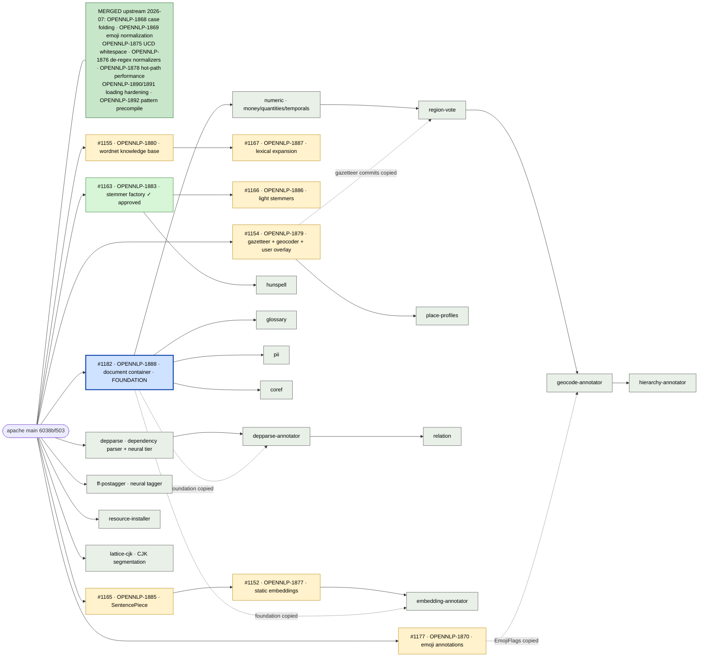

# Research branch map

This fork's layout: `main` mirrors `apache/opennlp` main exactly and never diverges, keeping the fork a clean base for upstream work; `kristian-3.x-features` is the research arm and the default branch, a regenerated integration line that merges every open pull request head and every admitted feature branch (each build records its exact inputs in `PIPESTREAM-PROVENANCE.txt`, and artifacts publish only as the `3.x-preview-SNAPSHOT` Maven snapshot); everything else is one feature per branch, stacked on its true dependency. Feature branches may be numerous and unvetted; a branch joins the research arm through a pull request based on `kristian-3.x-features`, whose merge adds it to the regeneration list. Nothing ever merges out of the research arm, and none of this touches the upstream project's own process. Read the warning at the top of [README.md](README.md) before using anything here. State below is as of 2026-07-19.

## Merge strategy

Solid arrows are the verified git base of each branch. Dashed arrows are commits a branch carries as copies of another branch's work so it compiles standalone; the copies drop automatically (by patch id) when the parent lands and the branch rebases. Staged branches are renamed to their real JIRA keys before any upstream promotion.

## Open pull requests against apache/opennlp

| PR | JIRA | What it offers | Status | Notes |
|---|---|---|---|---|
| [#1182](https://github.com/apache/opennlp/pull/1182) | OPENNLP-1888 | The document container: immutable `Document`, typed layers with positional/document scope, namespaced layer keys, adapters for the classic tools, manual chapter | Draft, reviewer-endorsed, spec points landed | The foundation every staged annotator below builds on |
| [#1161](https://github.com/apache/opennlp/pull/1161) | OPENNLP-1878 | Hot-path performance rewrites | Approved, eval build pending | Roughly 2x on the touched paths, measured per-path on the PR |
| [#1177](https://github.com/apache/opennlp/pull/1177) | OPENNLP-1870 | Offset-aware emoji annotations, including ISO region decoding of flag emoji | Open | |
| [#1163](https://github.com/apache/opennlp/pull/1163) | OPENNLP-1883 | Thread-safe `SnowballStemmer`, `StemmerFactory` seam, caching stemmer | Approved | |
| [#1166](https://github.com/apache/opennlp/pull/1166) | OPENNLP-1886 | Sixteen UniNE light/minimal stemmer tiers | Draft, stacked on #1163 | Parity fixtures regenerated from the original implementations |
| [#1155](https://github.com/apache/opennlp/pull/1155) | OPENNLP-1880 | Lexical knowledge base seam with WN-LMF and WNDB readers and a Morphy lemmatizer | Draft | |
| [#1167](https://github.com/apache/opennlp/pull/1167) | OPENNLP-1887 | Weighted lexical expansion, synset similarity, hypernym-anchored typing | Draft, stacked on #1155 | |
| [#1165](https://github.com/apache/opennlp/pull/1165) | OPENNLP-1885 | Pure-Java SentencePiece inference with exact original-text spans, plus a WordPiece encoder | Ready for review | 6.47M pieces/s single-thread on the T5-small vocabulary, 1.42x the C++ reference measured through its Python binding |
| [#1152](https://github.com/apache/opennlp/pull/1152) | OPENNLP-1877 | Static text embeddings, pure JVM | Draft, stacked on #1165 | 12.9x single-thread and about 7x peak throughput of the Python reference at 0.22x the memory (potion-base-8M, output parity asserted first) |
| [#1154](https://github.com/apache/opennlp/pull/1154) | OPENNLP-1879 | Gazetteer and geocoder seam, bundled Natural Earth table, GeoNames and Overture loaders, place hierarchy, user-supplied overlay (additions, suppressions, bounding boxes) | Draft | Bring-your-own-gazetteer reference implementation kept in the test sources |

## Staged feature branches (this fork only, not yet proposed upstream)

All staged branches are rebased onto current apache main, tested at their tips, and carry `OPENNLP-XXXX-` names until their JIRA tickets are filed. The annotator branches require the #1182 document container and carry it as dropped-on-merge copies where noted in the diagram.

| Branch | What it offers | Status | Notes |
|---|---|---|---|
| `depparse` | Transition-based dependency parsing: classical perceptron tiers plus a feedforward neural tier with beam decoding | Staged | UD English EWT test, gold UPOS: 86.78 UAS / 84.61 LAS at beam 4; all-neural pipeline 84.30 / 80.79 at 452 tok/s with the vector-augmented tagger. The published Stanza end-to-end reference on the same treebank is 88.90 / 86.77, so this is not yet at parity; the tagger is the dominant gap |
| `ff-postagger` | Feedforward neural POS tagger on the same trainer recipe, with opt-in pretrained word-vector input features and a coverage lexicon | Staged | 94.68% on UD English EWT vs 93.75% for the best classical configuration in-tree; 95.51% with the opt-in vector block (potion-base-8M vectors plus a dictionary lexicon), defaults unchanged |
| `lattice-cjk` | Viterbi lattice segmentation over MeCab-format dictionaries (Japanese IPADIC, Korean mecab-ko-dic) plus a Chinese unigram segmenter | Staged | About 5M chars/s on real IPADIC; 392k dictionary entries load in under a second; dictionaries are always user-supplied, never bundled |
| `resource-installer` | User-supplied-URL model and data installer, SHA-256 verified before unpacking | Staged | Enabled a UD lemmatizer run at 87.76% lemma accuracy on EWT with the stock `LemmatizerME` |
| `hunspell` | Hunspell `.dic`/`.aff` affix stemmer, regex-free, fail-closed on unsupported features | Staged, stacked on #1163 | Validated against LibreOffice en/es/hu/de dictionaries; `AF` alias flags are a known gap (hu_HU loads but stems to identity) |
| `place-profiles` | Metadata-grounded place similarity over user-supplied profiles | Staged, stacked on #1154 | |
| `glossary` | Dictionary/glossary matching as a document layer | Staged, needs #1182 | |
| `pii` | PII detection and masking layers | Staged, needs #1182 | |
| `coref` | Coreference chains as a document layer | Staged, needs #1182 | |
| `numeric` | Money, quantities, temporals, and document-date layers with region-aware currency resolution | Staged, needs #1182 | |
| `region-vote` | Document-scoped region ballot: location mentions, country names, and flag emoji vote on where a document speaks from | Staged, on `numeric` | |
| `geocode-annotator` | Gazetteer-backed geocoding of location entities into a document layer | Staged, on `region-vote` | |
| `hierarchy-annotator` | Administrative containment chains for resolved locations | Staged, on `geocode-annotator` | |
| `depparse-annotator` | Per-sentence dependency parses as a document layer | Staged, on `depparse` | |
| `relation` | Predicate-driven relation mentions over dependency parses | Staged, on `depparse-annotator` | |
| `embedding-annotator` | Embedding vectors for any span layer (tokens, sentences) | Staged, on #1152 | |

## The path upstream

Moving a branch to Apache OpenNLP is a separate act from admitting it to the research arm, and it follows the upstream project's process, not ours: JIRA ticket filed and the branch renamed to its key, rebase onto its final parents, upstream pull request opened when the intake queue has room to review and vet it properly, and the upstream review then judges it on the project's normal standards. Until all of that happens for a given branch, treat its content as a demo.
