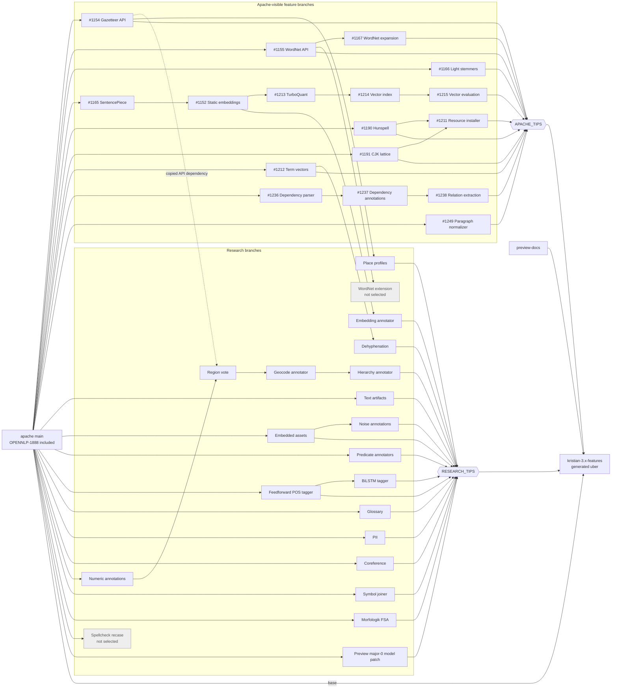

# Research branch map

State verified on 2026-09-01 against Apache GitHub, every live worktree in
`repos.all.txt`, the org remote, `regen-uber.sh`, and the current provenance
manifest.

Apache main is `e04982a481`. It includes the typed Document container from
merged PR #1182. The public `OPENNLP-1833-grpc-helper` is `a4084cabe0`
locally and `efbede99ac` on Apache until pushed. The local helper contains
Apache main plus all 17 open pull requests in the 3.x review graph, drafts
included. No open 2.x pull request belongs in this helper.

`regen-uber.sh` now starts from current main, drops the merged #1182 branch,
and selects the cascaded heads shown below. The exact refs in the last
completed preview remain recorded in `PIPESTREAM-PROVENANCE.txt`; during a
cascade that generated manifest can temporarily trail this membership plan.

## Integration model

- `APACHE_TIPS` and `RESEARCH_TIPS` in `regen-uber.sh` are the durable uber
  membership lists.
- The gRPC helper is a different aggregation. It takes every open 3.x PR head,
  not only the Apache tips selected for uber.
- A listed tip brings its dependency stack. Do not merge both a stack tip and
  a second copy of the same feature.
- `PIPESTREAM-PROVENANCE.txt` describes only the last completed uber build.
- Nothing merges out of uber. Fixes land on the owning branch, then the stack
  is cascaded and uber is regenerated.

## Uber branch topology

Solid arrows show true Git parentage. The dotted gazetteer arrow is a copied,
patch-equivalent API dependency carried by the region stack. Arrows into
`APACHE_TIPS` and `RESEARCH_TIPS` show the direct membership recorded in
`regen-uber.sh`; a selected child also brings its parent stack. The two gray
research branches remain available but are not selected for uber.

```mermaid
flowchart LR
  main["apache main<br/>OPENNLP-1888 included"]
  uber["kristian-3.x-features<br/>generated uber"]
  apacheTips{{"APACHE_TIPS"}}
  researchTips{{"RESEARCH_TIPS"}}

  subgraph apache["Apache-visible feature branches"]
    gaz["#1154 Gazetteer API"]
    wordnet["#1155 WordNet API"]
    expansion["#1167 WordNet expansion"]
    light["#1166 Light stemmers"]
    sentencepiece["#1165 SentencePiece"]
    static["#1152 Static embeddings"]
    turbo["#1213 TurboQuant"]
    vector["#1214 Vector index"]
    evaluation["#1215 Vector evaluation"]
    hunspell["#1190 Hunspell"]
    lattice["#1191 CJK lattice"]
    installer["#1211 Resource installer"]
    termvector["#1212 Term vectors"]
    parser["#1236 Dependency parser"]
    dependency["#1237 Dependency annotations"]
    relation["#1238 Relation extraction"]
    paragraph["#1249 Paragraph normalizer"]
  end

  subgraph research["Research branches"]
    artifacts["Text artifacts"]
    assets["Embedded assets"]
    noise["Noise annotations"]
    predicates["Predicate annotators"]
    ffpos["Feedforward POS tagger"]
    bilstm["BiLSTM tagger"]
    glossary["Glossary"]
    pii["PII"]
    coref["Coreference"]
    numeric["Numeric annotations"]
    region["Region vote"]
    geocode["Geocode annotator"]
    hierarchy["Hierarchy annotator"]
    profiles["Place profiles"]
    embedding["Embedding annotator"]
    symbols["Symbol joiner"]
    morfologik["Morfologik FSA"]
    dehyphenation["Dehyphenation"]
    recase["Spellcheck recase<br/>not selected"]
    wordnetExtension["WordNet extension<br/>not selected"]
    major0["Preview major-0 model patch"]
  end

  previewDocs["preview-docs"]

  main --> gaz
  main --> wordnet --> expansion
  main --> light
  main --> sentencepiece --> static --> turbo --> vector --> evaluation
  main --> hunspell
  main --> lattice
  hunspell --> installer
  lattice --> installer
  main --> termvector
  main --> parser --> dependency --> relation
  main --> paragraph

  main --> artifacts
  main --> assets --> noise
  main --> predicates
  main --> ffpos --> bilstm
  main --> glossary
  main --> pii
  main --> coref
  main --> numeric --> region --> geocode --> hierarchy
  gaz -. copied API dependency .-> region
  gaz --> profiles
  static --> embedding
  termvector --> dehyphenation
  main --> symbols
  main --> morfologik
  main --> recase
  wordnet --> wordnetExtension
  main --> major0

  gaz --> apacheTips
  wordnet --> apacheTips
  expansion --> apacheTips
  light --> apacheTips
  hunspell --> apacheTips
  lattice --> apacheTips
  installer --> apacheTips
  termvector --> apacheTips
  evaluation --> apacheTips
  relation --> apacheTips
  paragraph --> apacheTips

  artifacts --> researchTips
  assets --> researchTips
  noise --> researchTips
  predicates --> researchTips
  ffpos --> researchTips
  bilstm --> researchTips
  glossary --> researchTips
  pii --> researchTips
  coref --> researchTips
  hierarchy --> researchTips
  profiles --> researchTips
  embedding --> researchTips
  symbols --> researchTips
  morfologik --> researchTips
  dehyphenation --> researchTips
  major0 --> researchTips

  main -->|base| uber
  apacheTips --> uber
  researchTips --> uber
  previewDocs --> uber

  classDef parked fill:#eee,stroke:#888,color:#555;
  class recase,wordnetExtension parked;
```

## Open Apache 3.x pull requests

| PR | Feature | Live base | Apache head | Local cascaded head | Review state | Uber membership |
| --- | --- | --- | --- | --- | --- | --- |
| [#1152](https://github.com/apache/opennlp/pull/1152) | Static embeddings | `sentencepiece` | `f6f1bef48e` | `5932a665cd` | Draft, no decision | Via #1215 |
| [#1154](https://github.com/apache/opennlp/pull/1154) | Gazetteer and geocoder API | `main` | `b81d0eb978` | `e521e27e82` | Draft, review required | Direct |
| [#1155](https://github.com/apache/opennlp/pull/1155) | WordNet API and readers | `main` | `9c0e9a0533` | `ef079e469f` | Draft, review required | Direct |
| [#1165](https://github.com/apache/opennlp/pull/1165) | SentencePiece and WordPiece | `main` | `45db4212db` | `f4ca34e7d8` | Ready, review required | Via #1215 |
| [#1166](https://github.com/apache/opennlp/pull/1166) | UniNE light and minimal stemmers | `main` | `ff681b3934` | `2a0327109b` | Draft, review required | Direct |
| [#1167](https://github.com/apache/opennlp/pull/1167) | WordNet expansion | `main` | `a68762fe35` | `278906b284` | Draft, review required | Direct |
| [#1190](https://github.com/apache/opennlp/pull/1190) | Hunspell stemming | `main` | `39b576e456` | `db1da98893` | Ready, changes requested | Direct |
| [#1191](https://github.com/apache/opennlp/pull/1191) | CJK lattice tokenization | `main` | `85cb63f509` | `f24fbad354` | Ready, changes requested | Direct |
| [#1211](https://github.com/apache/opennlp/pull/1211) | Verified resource installer | `main` | `bca31fc386` | `5bb2225689` | Ready, review required | Direct |
| [#1212](https://github.com/apache/opennlp/pull/1212) | Document term vectors | `main` | `f35d20ac55` | `586e573eb1` | Draft, review required | Direct |
| [#1213](https://github.com/apache/opennlp/pull/1213) | TurboQuant embedding tables | `main` | `05398bb677` | `f7555c212e` | Draft, review required | Via #1215 |
| [#1214](https://github.com/apache/opennlp/pull/1214) | Bounded in-memory vector indexes | `main` | `ac501e2259` | `2ac32073a7` | Draft, review required | Via #1215 |
| [#1215](https://github.com/apache/opennlp/pull/1215) | Vector-search evaluation | `main` | `5b79627bb8` | `daaf75f2ad` | Draft, review required | Direct stack tip |
| [#1236](https://github.com/apache/opennlp/pull/1236) | Dependency parser | `main` | `71da20136a` | `83bc298189` | Draft, review required | Via #1238 |
| [#1237](https://github.com/apache/opennlp/pull/1237) | Dependency Document layer | `OPENNLP-547-dependency-parser` | `75bf330a26` | `69d4ad8988` | Draft, no decision | Via #1238 |
| [#1238](https://github.com/apache/opennlp/pull/1238) | Dependency-path relation extraction | `OPENNLP-1919-dependency-annotations` | `9c860c3afc` | `8f05adef90` | Draft, no decision | Direct stack tip |
| [#1249](https://github.com/apache/opennlp/pull/1249) | Paragraph normalizer | `main` | `6b956c72f1` | External head | Approved | Direct external head |

PRs #1182, #1247, and #1250 merged and are now supplied by main. PR #1249 is
the selected OPENNLP-1921 implementation; the earlier local competing branch
is review-only and is not an uber feature source. The local cascaded heads have
not been pushed to their Apache branches.

## Research worktrees

Every research worktree was cascaded on 2026-09-01. Current Apache main is an
ancestor of every branch, and every stacked child has its current true parent
as an ancestor. `Org ref differs` means the ai-pipestream branch still points
to the pre-cascade history. It must not be updated without explicit push
authorization.

| Branch | Local head | Preview membership | True dependency | Org ref |
| --- | --- | --- | --- | --- |
| `OPENNLP-XXXX-bilstm-tagger` | `4ac5849bca` | Direct | Feedforward tagger | Differs |
| `OPENNLP-XXXX-coref` | `9121979a94` | Direct | Apache main | Differs |
| `OPENNLP-XXXX-dehyphenation` | `63e65a0d32` | Direct | #1212 term vectors | Differs |
| `OPENNLP-XXXX-embedded-assets` | `ac56a2a0f3` | Direct | Apache main | Differs |
| `OPENNLP-XXXX-embedding-annotator` | `d70a8942fa` | Direct | #1152 static embeddings | Differs |
| `OPENNLP-XXXX-ff-postagger` | `3f90ff1507` | Direct | Apache main | Differs |
| `OPENNLP-XXXX-geocode-annotator` | `05198a8a0c` | Via hierarchy tip | Region vote | Differs |
| `OPENNLP-XXXX-glossary` | `57c54656cf` | Direct | Apache main | Differs |
| `OPENNLP-XXXX-hierarchy-annotator` | `68e0726b0b` | Direct stack tip | Geocode annotator | Differs |
| `OPENNLP-XXXX-morfologik-fsa` | `593cbd5a8d` | Direct | Apache main | Differs |
| `OPENNLP-XXXX-noise` | `ccdbdcb640` | Direct | Embedded assets | Differs |
| `OPENNLP-XXXX-numeric` | `c4940c087a` | Via hierarchy tip | Apache main | Differs |
| `OPENNLP-XXXX-pii` | `555aceeab2` | Direct | Apache main | Differs |
| `OPENNLP-XXXX-place-profiles` | `41408f9d4c` | Direct | #1154 gazetteer API | Differs |
| `OPENNLP-XXXX-predicate-annotators` | `75e52ae253` | Direct | Apache main | Differs |
| `OPENNLP-XXXX-region-vote` | `9d3e739d53` | Via hierarchy tip | Numeric annotations; copied #1154 API | Differs |
| `OPENNLP-XXXX-spellcheck-recase` | `313dd41322` | Not selected | Apache main | Differs |
| `OPENNLP-XXXX-symbol-joiner` | `4c9352418a` | Direct | Apache main | Differs |
| `OPENNLP-XXXX-text-artifacts` | `fe737f000b` | Direct | Apache main | Differs |
| `OPENNLP-XXXX-wordnet-extension` | `83d8fe318d` | Not selected | #1155 WordNet API | Differs |

The BiLSTM accuracy gate remains open at 96.294 against a 97.0 target. Active
maturity requirements for every feature live in the workspace `TODO/`
directory, not in this branch-status map.

## Path upstream

1. File or select the JIRA issue and rename the local branch and worktree.
2. Rebase or cascade onto the current true parent. Use `git range-diff` or
   patch IDs to prove the feature delta did not change.
3. Run the owning tests, the relevant reactor gate, and `krickert-review`.
4. Push to Apache only with the user's one-time authorization.
5. Move uber membership from `RESEARCH_TIPS` to `APACHE_TIPS` when the source
   becomes Apache-visible. Never merge both copies.
6. Regenerate the helper if the new source is in the open 3.x PR graph, then
   regenerate uber and verify its provenance and package gate.

Filing a JIRA does not publish an org branch. The Apache branch or PR can be
linked from JIRA when the feature graduates.
