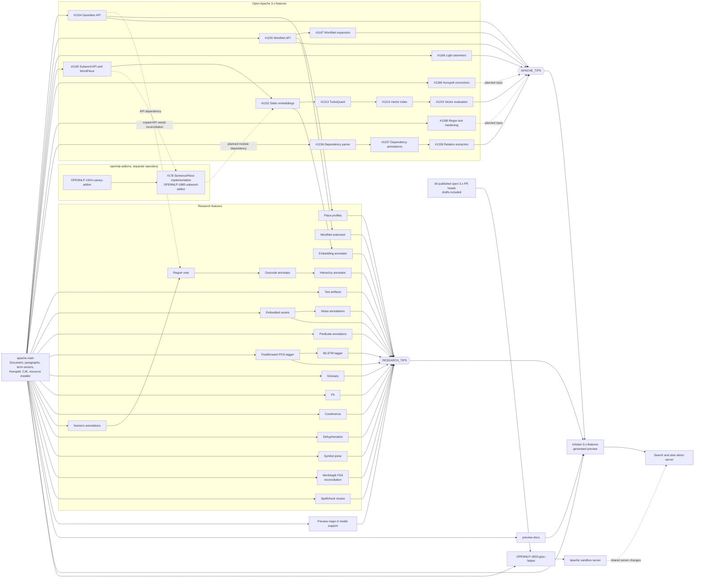

# Research branch map

Verified on 2026-09-05 using local Git history, published fork refs, Apache PR
metadata, `regen-uber.sh`, and the last generated provenance manifest.
This is the maintained map on `preview-docs`. The copy in `uber/` updates
with the next integration build.

Apache main is `535c6d43a`. It includes Document #1182, paragraph normalization
#1249, term vectors #1212, Hunspell #1190, CJK #1191 and #1265, and the resource
installer #1211. Features use those implementations from main.

The map covers 14 open 3.x PR branches and 20 research branches. Only Hunspell
follow-up, regex hardening, and glossary contain current main: 31 of 34 branches
need a main sync. Of these 34, 28 need local/fork history reconciliation; 6 local
heads equal their fork heads. These are Git ancestry checks, not test results.
Several branches lack only main's latest CI change; others also lack merged
features.

## Integration intent and current state

- Independent features depend on current main. Dependent features use the
  updated parent branch, including main through that parent.
- `APACHE_TIPS` and `RESEARCH_TIPS` in `regen-uber.sh` define the current
  direct preview inputs. A stack tip must contain the current parent commits
  before it can substitute for those parents.
- The helper consumes published open 3.x PR heads, including drafts. Local
  research is excluded. The preview combines the selected feature branches
  and admitted research.
- The current script selects 6 Apache tips and 18 research/preview tips.
  Hunspell #1266 and regex #1268 are missing direct inputs for the intended
  complete preview. Their additions are planned, not yet applied to the script.
- The last local preview is `a0f8efa05`, generated on 2026-09-04 from main
  `144be05ae`. Its manifest is a build snapshot, not a current branch inventory.
- Local helper `16e3568c2` also lacks current main and the current published
  heads of #1155, #1266, and #1268. Helper publication to Apache needs separate
  authorization.
- Feature fixes remain on feature branches. Integration branches are not
  sources for feature updates.

## Intended dependency tree

Solid feature arrows show the intended source dependencies, not a claim that
the current parent tip is already an ancestor. Solid arrows into the input
groups reflect the current script. Dotted arrows identify copied APIs,
cross-repository dependencies, planned inputs, or shared server changes.
The tables below describe current state.

```mermaid
flowchart LR
  main["apache main<br/>Document, paragraphs, term vectors,<br/>Hunspell, CJK, resource installer"]
  uber["kristian-3.x-features<br/>generated preview"]
  apacheTips{{"APACHE_TIPS"}}
  researchTips{{"RESEARCH_TIPS"}}

  subgraph apache["Open Apache 3.x features"]
    gaz["#1154 Gazetteer API"]
    wordnet["#1155 WordNet API"]
    expansion["#1167 WordNet expansion"]
    light["#1166 Light stemmers"]
    sentencepiece["#1165 Subword API and WordPiece"]
    static["#1152 Static embeddings"]
    turbo["#1213 TurboQuant"]
    vector["#1214 Vector index"]
    evaluation["#1215 Vector evaluation"]
    hunspellFix["#1266 Hunspell corrections"]
    regexFix["#1268 Regex test hardening"]
    parser["#1236 Dependency parser"]
    dependency["#1237 Dependency annotations"]
    relation["#1238 Relation extraction"]
  end

  subgraph addons["opennlp-addons, separate repository"]
    canary["OPENNLP-1924-canary-addon"]
    subwordAddon["#178 SentencePiece implementation<br/>OPENNLP-1885-subword-addon"]
    canary --> subwordAddon
  end

  subgraph research["Research features"]
    artifacts["Text artifacts"]
    assets["Embedded assets"]
    noise["Noise annotations"]
    predicates["Predicate annotators"]
    ffpos["Feedforward POS tagger"]
    bilstm["BiLSTM tagger"]
    glossary["Glossary"]
    pii["PII"]
    coref["Coreference"]
    numeric["Numeric annotations"]
    region["Region vote"]
    geocode["Geocode annotator"]
    hierarchy["Hierarchy annotator"]
    profiles["Place profiles"]
    embedding["Embedding annotator"]
    symbols["Symbol joiner"]
    morfologik["Morfologik FSA<br/>reconciliation"]
    dehyphenation["Dehyphenation"]
    recase["Spellcheck recase"]
    wordnetExtension["WordNet extension"]
  end

  major0["Preview major-0 model support"]
  previewDocs["preview-docs"]
  publishedPrs["All published open 3.x PR heads<br/>drafts included"]
  helper["OPENNLP-1833-grpc-helper"]
  apacheServer["Apache sandbox server"]
  demoServer["Search and uber-demo server"]

  main --> gaz
  main --> wordnet --> expansion
  main --> light
  main --> sentencepiece --> static --> turbo --> vector --> evaluation
  main --> hunspellFix
  main --> regexFix
  main --> parser --> dependency --> relation
  sentencepiece -. API dependency .-> subwordAddon
  subwordAddon -. planned module dependency .-> static

  main --> artifacts
  main --> assets --> noise
  main --> predicates
  main --> ffpos --> bilstm
  main --> glossary
  main --> pii
  main --> coref
  main --> numeric --> region --> geocode --> hierarchy
  gaz -. copied API needs reconciliation .-> region
  gaz --> profiles
  static --> embedding
  main --> dehyphenation
  main --> symbols
  main --> morfologik
  main --> recase
  wordnet --> wordnetExtension
  main --> major0
  main --> previewDocs

  gaz --> apacheTips
  wordnet --> apacheTips
  expansion --> apacheTips
  light --> apacheTips
  evaluation --> apacheTips
  relation --> apacheTips
  hunspellFix -. planned input .-> apacheTips
  regexFix -. planned input .-> apacheTips

  artifacts --> researchTips
  assets --> researchTips
  noise --> researchTips
  predicates --> researchTips
  ffpos --> researchTips
  bilstm --> researchTips
  glossary --> researchTips
  pii --> researchTips
  coref --> researchTips
  hierarchy --> researchTips
  profiles --> researchTips
  embedding --> researchTips
  symbols --> researchTips
  recase --> researchTips
  morfologik --> researchTips
  dehyphenation --> researchTips
  wordnetExtension --> researchTips
  major0 --> researchTips

  main --> uber
  apacheTips --> uber
  researchTips --> uber
  previewDocs --> uber
  main --> helper
  publishedPrs --> helper
  helper --> apacheServer
  uber --> demoServer
  apacheServer -. shared server changes .-> demoServer
```

## Open Apache 3.x pull requests

“PR source” identifies the repository containing the PR head, not the PR
destination. “Main missing” counts main commits not reachable from the local
head. A PR marked Ready is not necessarily approved or validated for merge.

| PR / feature | Published base | PR source | Published head | Local head | Main missing | Review state | Preview input |
| --- | --- | --- | --- | --- | --- | --- | --- |
| [#1152](https://github.com/apache/opennlp/pull/1152) Static embeddings | `OPENNLP-1885-sentencepiece` | ai-pipestream | `f6f1bef48e` | `ff83d94ad6` | 5 | Draft | Via #1215, needs cascade |
| [#1154](https://github.com/apache/opennlp/pull/1154) Gazetteer API | `main` | ai-pipestream | `b81d0eb978` | `27ba5f95c9` | 3 | Draft | Direct |
| [#1155](https://github.com/apache/opennlp/pull/1155) WordNet API | `main` | ai-pipestream | `19791cfdf5` | `19791cfdf5` | 1 | Draft | Direct |
| [#1165](https://github.com/apache/opennlp/pull/1165) Subword API and WordPiece | `main` | ai-pipestream | `141160e439` | `141160e439` | 3 | Ready | Via #1215, needs API reconciliation |
| [#1166](https://github.com/apache/opennlp/pull/1166) Light stemmers | `main` | ai-pipestream | `233514d523` | `233514d523` | 1 | Draft | Direct |
| [#1167](https://github.com/apache/opennlp/pull/1167) WordNet expansion | `main` | ai-pipestream | `1d13232d89` | `1d13232d89` | 1 | Draft | Direct |
| [#1213](https://github.com/apache/opennlp/pull/1213) TurboQuant | `main` | ai-pipestream | `05398bb677` | `fd1f4f354d` | 5 | Draft | Via #1215, needs cascade |
| [#1214](https://github.com/apache/opennlp/pull/1214) Vector indexes | `main` | ai-pipestream | `ac501e2259` | `2917c32dd9` | 5 | Draft | Via #1215, needs cascade |
| [#1215](https://github.com/apache/opennlp/pull/1215) Vector evaluation | `main` | ai-pipestream | `5b79627bb8` | `3d27843220` | 5 | Draft | Direct stack tip |
| [#1236](https://github.com/apache/opennlp/pull/1236) Dependency parser | `main` | apache | `5cc405820d` | `5cc405820d` | 1 | Ready | Via #1238, needs cascade |
| [#1237](https://github.com/apache/opennlp/pull/1237) Dependency annotations | `OPENNLP-547-dependency-parser` | apache | `75bf330a26` | `f8498b1e60` | 3 | Draft | Via #1238 |
| [#1238](https://github.com/apache/opennlp/pull/1238) Relation extraction | `OPENNLP-1919-dependency-annotations` | apache | `9c860c3afc` | `92df0620cc` | 3 | Draft | Direct stack tip |
| [#1266](https://github.com/apache/opennlp/pull/1266) Hunspell corrections | `main` | ai-pipestream | `8baa234d05` | `8baa234d05` | 0 | Ready, changes requested | Planned direct input, not selected |
| [#1268](https://github.com/apache/opennlp/pull/1268) Regex test hardening | `main` | ai-pipestream | `c27a029674` | `c27a029674` | 0 | Ready, approved | Planned direct input, not selected |

Fork publication alone does not update #1236, #1237, or #1238: their PR source
branches are on apache/opennlp. Keep fork synchronization and Apache PR
publication separate.

Static embeddings still includes an older subword API, `BertTokenizer`, and
the in-repository SentencePiece implementation. It does not contain the current
#1165 tip. Reconcile the API with #1165 and preserve working SentencePiece
support while arranging the add-on module dependency. Do not remove the
implementation before its replacement builds and passes the existing tests.

Add-ons #178 is a draft at `b9a57b3dc7`, based on
`OPENNLP-1924-canary-addon`, not add-ons main. It is a separate repository
dependency, not an OpenNLP Git parent.

Hunspell #1266 uses the ResourceInstaller merged through #1211. Its downloader,
catalog, installer, and installer tests match current main. Review process
items remain: new JIRA key, title, unsupported-directive policy, and posting
dictionary results. This documentation update does not change that behavior.

The original Hunspell and CJK worktrees contain uncommitted edits requiring
comparison with the merged implementations. Exclude them from bulk publication
or deletion until that comparison is complete. The merged downloader worktree
was removed after preserving its commits in a verified recovery bundle.
Review checkouts, backup refs, `deregex`, and unrelated maintenance branches
are outside this feature inventory; do not include them in a bulk push.

## Research worktrees

All 20 research branches have an existing fork destination with history on
both the local and remote sides. Their tracked working files are clean;
temporary untracked feature READMEs are not part of the commit hashes below.
“Via hierarchy tip” describes the intended stack; it does not confirm that
the latest numeric changes are included.

| Branch | Local head | Main missing | Preview input | Intended dependency | Fork status |
| --- | --- | --- | --- | --- | --- |
| `OPENNLP-XXXX-bilstm-tagger` | `3d0171c3ff` | 5 | Direct | Feedforward tagger | Reconcile histories |
| `OPENNLP-XXXX-coref` | `6392b92f0b` | 1 | Direct | main | Reconcile histories |
| `OPENNLP-XXXX-dehyphenation` | `730f69cf4d` | 5 | Direct | main (term vectors included) | Reconcile histories |
| `OPENNLP-XXXX-embedded-assets` | `a6b4e21a37` | 1 | Direct | main | Reconcile histories |
| `OPENNLP-XXXX-embedding-annotator` | `b424c9fcc2` | 5 | Direct | #1152 static embeddings | Reconcile histories |
| `OPENNLP-XXXX-ff-postagger` | `02744d5e84` | 5 | Direct | main | Reconcile histories |
| `OPENNLP-XXXX-geocode-annotator` | `f1ce6f0a38` | 5 | Via hierarchy tip | Region vote | Reconcile histories |
| `OPENNLP-XXXX-glossary` | `fa7a2f6f1f` | 0 | Direct | main | Reconcile histories |
| `OPENNLP-XXXX-hierarchy-annotator` | `1088aa8115` | 5 | Direct | Geocode annotator | Reconcile histories |
| `OPENNLP-XXXX-morfologik-fsa` | `a0d1e6ba61` | 5 | Direct | main; reconcile existing extension | Reconcile histories |
| `OPENNLP-XXXX-noise` | `747c77d563` | 1 | Direct | Embedded assets | Reconcile histories |
| `OPENNLP-XXXX-numeric` | `7995de237e` | 5 | Via hierarchy tip | main | Reconcile histories |
| `OPENNLP-XXXX-pii` | `cb6ad708a1` | 5 | Direct | main | Reconcile histories |
| `OPENNLP-XXXX-place-profiles` | `d9e8487c3f` | 3 | Direct | #1154 gazetteer | Reconcile histories |
| `OPENNLP-XXXX-predicate-annotators` | `74eccb576e` | 1 | Direct | main | Reconcile histories |
| `OPENNLP-XXXX-region-vote` | `ef53423ee9` | 5 | Via hierarchy tip | Numeric + #1154 copied API | Reconcile histories |
| `OPENNLP-XXXX-spellcheck-recase` | `3d7c58f774` | 5 | Direct | main | Reconcile histories |
| `OPENNLP-XXXX-symbol-joiner` | `d537fb06e5` | 5 | Direct | main | Reconcile histories |
| `OPENNLP-XXXX-text-artifacts` | `0badf4ab62` | 1 | Direct | main | Reconcile histories |
| `OPENNLP-XXXX-wordnet-extension` | `63a22b4b2d` | 5 | Direct | #1155 WordNet | Reconcile histories |

## Parent updates still required

| Family | Current state |
| --- | --- |
| Subwords and vectors | Static embeddings lacks the current #1165 tip. TurboQuant, vector index, vector evaluation, and the embedding annotator each lack the latest review commit from their immediate parent. |
| Parser and annotations | Dependency annotations lacks the current parser tip. Relation extraction includes the current annotation tip, so update annotations before relation extraction. |
| WordNet | Expansion and the research extension do not include the current WordNet API tip. Compare copied code as well as commit ancestry. |
| Embedded assets | Noise lacks the latest embedded-assets review commit. |
| Numeric and geocoding | Region vote lacks the latest numeric commit. Geocode and hierarchy include their current immediate parents, but need that update after region vote. |
| Gazetteer | Place profiles includes the current gazetteer tip. Region vote has a copied API with older Javadoc contracts, including the empty-set contract for `sources()`; reconcile it with the maintained API. |

The feedforward/BiLSTM parent relation is current. Both branches still need
current main. A branch can include its current parent and still need upstream
updates.

The selected script tips do not yet include the current heads of #1165,
#1152, #1213, #1214, #1236, or numeric. Rebuilding with the existing script
before the cascade would omit some reviewed commits even if the build passes.

`preview-docs` and `preview-accept-major0-models` each lack 5 current main
commits and also need fork history reconciliation. They are preview support
branches, outside the 34-feature count.

## Add-ons candidates

This is a routing list, not an Apache consensus decision. Document container, term
vectors, Hunspell stemming, CJK lattice tokenization, and the resource
installer are already in core. The remaining narrow core candidates are the
subword API and WordPiece (#1165) and the dependency parser (#1236).

| Family | Candidate add-ons |
| --- | --- |
| Subwords | The concrete SentencePiece implementation is already separated as `subword-addon` in add-ons PR #178. |
| Embeddings and vector search | Static embeddings (#1152), TurboQuant (#1213), vector indexes (#1214), vector evaluation (#1215), and the embedding annotator. |
| Gazetteers and geocoding | The concrete geocoder from #1154, place profiles, numeric and region voting, geocoding, and hierarchy annotation. |
| WordNet | Readers and expansion from #1155 and #1167, plus the research WordNet extension. |
| Taggers | Feedforward and BiLSTM POS taggers. |
| Document analysis | Coreference, dehyphenation, glossary, PII, predicate, dependency-layer (#1237), and relation extraction (#1238) annotators. |
| Text preparation | Embedded assets, noise cleanup, spellcheck recasing, symbol joining, and text-artifact normalization. |
| Stemming | The light stemmers in #1166 fit the existing `Stemmer` contract and can be delivered as add-ons. |

If one of these implementations exposes a missing contract needed by several
modules, only that small contract is a core candidate. The Morfologik FSA
branch is reconciliation work against the existing extension, not a new add-on
to publish.

## Publication plan

Preserve existing local and published commits. Synchronization does not require
rewriting the feature branches.

1. Capture local and remote heads and preserve uncommitted files before updates.
2. Compare local-only and remote-only changes, including equivalent changes
   from earlier rebases. Resolve meaningful differences; do not select an entire
   side of a conflict without review.
3. Merge the existing fork history and current main into independent branches.
   Update dependent branches by merging the reconciled current parents, in
   dependency order. The downloader from main remains the implementation.
4. Check that the old local head, old fork head, current main, and required
   parent heads are ancestors of the result. Run feature tests, the affected
   package/manual build, and the pre-push review.
5. Push tested results to the existing fork branch names with normal
   fast-forward pushes. Fetch and reconsider if a remote advances.
6. Update preview inputs, then update helper and uber after the feature
   cascade. The current regeneration script resets the integration ref, so it
   needs a non-rewriting update path before use under this preservation plan.

The workspace execution checklist is `TODO/BRANCH-PUBLICATION.md`. No branch
history, script membership, PR state, or remote ref was changed by this map
update. The earlier force-push commands are not the selected publication plan.

JIRA tracking, add-on migration, Apache branch updates, and PR publication remain
separate actions. Research can be backed up to the fork without changing
graduation status.
