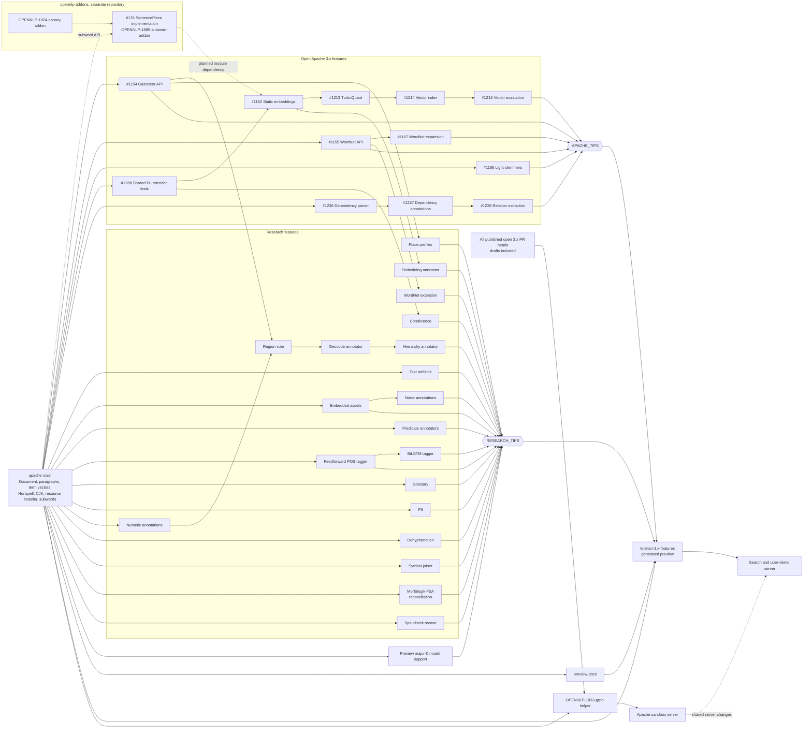

# Research branch map

Checked on 2026-09-08 against local Git history, published PR heads and
`regen-uber.sh`. This is the maintained map on `preview-docs`; the copy in
`uber/` belongs to its recorded build.

Apache main is `b453b9ee3`. It includes Document #1182, paragraph normalization
#1249, term vectors #1212, Hunspell #1190 and #1266, CJK #1191 and #1265,
the resource installer #1211, regex test hardening #1268, and the subword API
and WordPiece encoder #1165. Features use those implementations from main.

All 32 admitted feature heads contain this main and their updated parents.
The cascade preserves previous local and published commits. This states Git
ancestry, not completion of every feature: the candidate-selection changes in
the region-vote and geocode working trees remain uncommitted and excluded.

## Integration intent and current state

- Independent features depend on main. Dependent features contain the updated
  parent branches.
- `APACHE_TIPS` and `RESEARCH_TIPS` in `regen-uber.sh` select six Apache
  tips and eighteen research/preview tips. Those tips subsume the 32 admitted
  feature branches, including the shared DL encoder tests in #1288.
- The helper consumes published open 3.x PR heads, including drafts, but not
  unpublished research. New public maintenance PRs are helper inputs; they
  are not automatically admitted to the research preview.
- Feature fixes stay on their owning branches. Nothing merges out of uber.
- Six verified review batches were pushed to the fork before this main
  cascade: gazetteer, relation, noise, embedded assets, BiLSTM and PII.
  Publication of the aligned heads and integration builds is being verified.
- The last published helper is `4d2579294`; the last published uber is
  `da898e16a`. Neither represents this completed feature cascade yet.
  Build provenance, publication and deployment are separate checks.

## Intended dependency tree

Solid feature arrows are verified parent relationships. Arrows into the input
groups reflect the script. Dotted arrows identify cross-repository dependencies,
planned add-on integration, or shared server changes.

```mermaid
flowchart LR
  main["apache main<br/>Document, paragraphs, term vectors,<br/>Hunspell, CJK, resource installer, subwords"]
  uber["kristian-3.x-features<br/>generated preview"]
  apacheTips{{"APACHE_TIPS"}}
  researchTips{{"RESEARCH_TIPS"}}

  subgraph apache["Open Apache 3.x features"]
    gaz["#1154 Gazetteer API"]
    wordnet["#1155 WordNet API"]
    expansion["#1167 WordNet expansion"]
    light["#1166 Light stemmers"]
    encoding["#1288 Shared DL encoder tests"]
    static["#1152 Static embeddings"]
    turbo["#1213 TurboQuant"]
    vector["#1214 Vector index"]
    evaluation["#1215 Vector evaluation"]
    parser["#1236 Dependency parser"]
    dependency["#1237 Dependency annotations"]
    relation["#1238 Relation extraction"]
  end

  subgraph addons["opennlp-addons, separate repository"]
    canary["OPENNLP-1924-canary-addon"]
    subwordAddon["#178 SentencePiece implementation<br/>OPENNLP-1885-subword-addon"]
    canary --> subwordAddon
  end

  subgraph research["Research features"]
    artifacts["Text artifacts"]
    assets["Embedded assets"]
    noise["Noise annotations"]
    predicates["Predicate annotators"]
    ffpos["Feedforward POS tagger"]
    bilstm["BiLSTM tagger"]
    glossary["Glossary"]
    pii["PII"]
    coref["Coreference"]
    numeric["Numeric annotations"]
    region["Region vote"]
    geocode["Geocode annotator"]
    hierarchy["Hierarchy annotator"]
    profiles["Place profiles"]
    embedding["Embedding annotator"]
    symbols["Symbol joiner"]
    morfologik["Morfologik FSA<br/>reconciliation"]
    dehyphenation["Dehyphenation"]
    recase["Spellcheck recase"]
    wordnetExtension["WordNet extension"]
  end

  major0["Preview major-0 model support"]
  previewDocs["preview-docs"]
  publishedPrs["All published open 3.x PR heads<br/>drafts included"]
  helper["OPENNLP-1833-grpc-helper"]
  apacheServer["Apache sandbox server"]
  demoServer["Search and uber-demo server"]

  main --> gaz
  main --> wordnet --> expansion
  main --> light
  main --> encoding --> static --> turbo --> vector --> evaluation
  main --> parser --> dependency --> relation
  main -. subword API .-> subwordAddon
  subwordAddon -. planned module dependency .-> static

  main --> artifacts
  main --> assets --> noise
  main --> predicates
  main --> ffpos --> bilstm
  main --> glossary
  main --> pii
  encoding --> coref
  main --> numeric --> region --> geocode --> hierarchy
  gaz --> region
  gaz --> profiles
  static --> embedding
  main --> dehyphenation
  main --> symbols
  main --> morfologik
  main --> recase
  wordnet --> wordnetExtension
  main --> major0
  main --> previewDocs

  gaz --> apacheTips
  wordnet --> apacheTips
  expansion --> apacheTips
  light --> apacheTips
  evaluation --> apacheTips
  relation --> apacheTips

  artifacts --> researchTips
  assets --> researchTips
  noise --> researchTips
  predicates --> researchTips
  ffpos --> researchTips
  bilstm --> researchTips
  glossary --> researchTips
  pii --> researchTips
  coref --> researchTips
  hierarchy --> researchTips
  profiles --> researchTips
  embedding --> researchTips
  symbols --> researchTips
  recase --> researchTips
  morfologik --> researchTips
  dehyphenation --> researchTips
  wordnetExtension --> researchTips
  major0 --> researchTips

  main --> uber
  apacheTips --> uber
  researchTips --> uber
  previewDocs --> uber
  main --> helper
  publishedPrs --> helper
  helper --> apacheServer
  uber --> demoServer
  apacheServer -. shared server changes .-> demoServer
```

## Open Apache 3.x pull requests

“PR source” identifies the repository containing the PR head, not the PR
destination. “Main missing” counts main commits not reachable from the local
head. A PR marked Ready is not necessarily approved or validated for merge.

| PR | Published base | PR source | Published head | Local head | Main missing | Review state |
| --- | --- | --- | --- | --- | --- | --- |
| [#1152](https://github.com/apache/opennlp/pull/1152) | `OPENNLP-1885-sentencepiece` | ai-pipestream | `54c70f8b2` | `cce72a000` | 0 | Draft |
| [#1154](https://github.com/apache/opennlp/pull/1154) | `main` | ai-pipestream | `054003020` | `19419c144` | 0 | Draft |
| [#1155](https://github.com/apache/opennlp/pull/1155) | `main` | ai-pipestream | `21250fd31` | `f9c56c495` | 0 | Draft |
| [#1288](https://github.com/apache/opennlp/pull/1288) | `main` | ai-pipestream | `9a7676e74` | `9a7676e74` | 0 | Draft |
| [#1166](https://github.com/apache/opennlp/pull/1166) | `main` | ai-pipestream | `642ecd211` | `59492abcb` | 0 | Draft |
| [#1167](https://github.com/apache/opennlp/pull/1167) | `main` | ai-pipestream | `306c782a8` | `4f91b1703` | 0 | Draft |
| [#1213](https://github.com/apache/opennlp/pull/1213) | `main` | ai-pipestream | `be60c7366` | `a43f3ac6e` | 0 | Draft |
| [#1214](https://github.com/apache/opennlp/pull/1214) | `main` | ai-pipestream | `b544be277` | `319ab6147` | 0 | Draft |
| [#1215](https://github.com/apache/opennlp/pull/1215) | `main` | ai-pipestream | `7313e21a9` | `7c253ead2` | 0 | Draft |
| [#1236](https://github.com/apache/opennlp/pull/1236) | `main` | apache | `ebf96ee89` | `12d9db03f` | 0 | Draft |
| [#1237](https://github.com/apache/opennlp/pull/1237) | `OPENNLP-547-dependency-parser` | apache | `762691d46` | `0f643ffef` | 0 | Draft |
| [#1238](https://github.com/apache/opennlp/pull/1238) | `OPENNLP-1919-dependency-annotations` | apache | `1d295c5f6` | `be054493d` | 0 | Draft |

Fork publication alone does not update #1236, #1237, or #1238: their PR source
branches are on apache/opennlp. Keep fork synchronization and Apache PR
publication separate.

Static embeddings and its descendants contain the current subword API and
WordPiece implementation. `BertTokenizer` is removed. The in-repository
SentencePiece implementation remains tested and available until migration to
the add-on dependency is complete. That migration is separate from branch
synchronization.

Add-ons #178 is a draft at `b9a57b3dc7`, based on
`OPENNLP-1924-canary-addon`, not add-ons main. It is a separate repository
dependency, not an OpenNLP Git parent.

Separate-repository work is not part of this OpenNLP cascade. The add-ons
canary `0f36b7c36` is published with DocBook documentation, naming changes,
and release checks. Draft #178 still needs that updated base and the matching
module/manual changes. The earlier sandbox audit found two commits missing
from its own main `f1cafcf5`, and three Apache-server development commits
missing from the uber-server line. Those server refs need a fresh audit before
work resumes. No add-ons or sandbox branch was changed during this cascade.

Hunspell #1266 is merged and its final review approved the corrections.
The implementation uses the ResourceInstaller from #1211.
[OPENNLP-1927](https://issues.apache.org/jira/browse/OPENNLP-1927) tracks
remaining Hunspell compatibility and strict-loading work. It does not change
the behavior carried by this synchronization. The review also requested
separate release-note tracking for the corrections already merged in #1266.

The original Hunspell and CJK worktrees contain uncommitted edits requiring
comparison with the merged implementations. Exclude them from bulk publication
or deletion until that comparison is complete. The merged downloader worktree
was removed after preserving its commits in a verified recovery bundle.
Review checkouts, backup refs, `deregex`, and unrelated maintenance branches
are outside this feature inventory; do not include them in a bulk push.

## Local work outside the preview

Hunspell compatibility [#1270](https://github.com/apache/opennlp/pull/1270)
is published at `b194f2162` and remains draft with changes requested.
It is already a helper input, but not a selected research preview input.
The dedicated Hunspell review owns its implementation and evaluations.

The public regex-maintenance PRs #1275 through #1282 and generic embedding
interface #1290 are outside the admitted 32-feature preview graph.
Their publication and review state should be checked independently.

## Research worktrees in the preview

All 20 research branch heads contain their existing fork heads and current main.
The region-vote and geocode worktrees still have pending candidate-policy edits;
those edits are not in the branch heads below. Temporary feature READMEs remain local.
The hierarchy tip contains current numeric, gazetteer, region, and geocode heads.

| Branch | Local head | Main missing | Preview input | Intended dependency | Fork status |
| --- | --- | --- | --- | --- | --- |
| `OPENNLP-XXXX-bilstm-tagger` | `9a4e0ea6c` | 0 | Direct | Feedforward tagger | Aligned head pending verification/push |
| `OPENNLP-XXXX-coref` | `3d16018da` | 0 | Direct | main subword API, #1288 encoder tests | Aligned head pending verification/push |
| `OPENNLP-XXXX-dehyphenation` | `9f6e33a2f` | 0 | Direct | main (term vectors included) | Aligned head pending verification/push |
| `OPENNLP-XXXX-embedded-assets` | `4bc77ebd3` | 0 | Direct | main | Aligned head pending verification/push |
| `OPENNLP-XXXX-embedding-annotator` | `76d096595` | 0 | Direct | #1152 static embeddings | Aligned head pending verification/push |
| `OPENNLP-XXXX-ff-postagger` | `1e84cac82` | 0 | Direct | main | Aligned head pending verification/push |
| `OPENNLP-XXXX-geocode-annotator` | `939ba00c8` | 0 | Via hierarchy tip | Region vote | Aligned head pending verification/push |
| `OPENNLP-XXXX-glossary` | `985ba0117` | 0 | Direct | main | Aligned head pending verification/push |
| `OPENNLP-XXXX-hierarchy-annotator` | `6d53ab34e` | 0 | Direct | Geocode annotator | Aligned head pending verification/push |
| `OPENNLP-XXXX-morfologik-fsa` | `1a047491c` | 0 | Direct | main; reconcile existing extension | Aligned head pending verification/push |
| `OPENNLP-XXXX-noise` | `6dbf42ad0` | 0 | Direct | Embedded assets | Aligned head pending verification/push |
| `OPENNLP-XXXX-numeric` | `fa258f964` | 0 | Via hierarchy tip | main | Aligned head pending verification/push |
| `OPENNLP-XXXX-pii` | `6541bcbba` | 0 | Direct | main | Aligned head pending verification/push |
| `OPENNLP-XXXX-place-profiles` | `b0b352fd2` | 0 | Direct | #1154 gazetteer | Aligned head pending verification/push |
| `OPENNLP-XXXX-predicate-annotators` | `e8354bc9f` | 0 | Direct | main | Aligned head pending verification/push |
| `OPENNLP-XXXX-region-vote` | `006840c62` | 0 | Via hierarchy tip | Numeric + #1154 gazetteer | Aligned head pending verification/push |
| `OPENNLP-XXXX-spellcheck-recase` | `78a2bf662` | 0 | Direct | main | Aligned head pending verification/push |
| `OPENNLP-XXXX-symbol-joiner` | `db2ee8658` | 0 | Direct | main | Aligned head pending verification/push |
| `OPENNLP-XXXX-text-artifacts` | `d60fe9b0f` | 0 | Direct | main | Aligned head pending verification/push |
| `OPENNLP-XXXX-wordnet-extension` | `45bd56ac4` | 0 | Direct | #1155 WordNet | Aligned head pending verification/push |

## Verified stacks

- Main subword API and #1288 tests -> static embeddings -> TurboQuant -> vector index -> evaluation.
  The embedding annotator contains current static embeddings.
- Main subword API and #1288 tests -> coreference, for its optional ONNX token-vector adapter.
  The resolver and trained models are unchanged by this compatibility update.
- Parser -> dependency annotations -> relation extraction.
- WordNet API -> expansion and research extension.
- Embedded assets -> noise; feedforward POS -> BiLSTM.
- Numeric and gazetteer -> region vote -> geocode -> hierarchy.
  Place profiles contains current gazetteer.

The TurboQuant cascade carries double-precision analogy queries through its
internal adapters. The WordNet extension carries the parent's stream ownership,
definition retention, and malformed-input checks without removing composition.

`preview-docs` and `preview-accept-major0-models` also contain current main and
their old fork heads. They are support branches, outside the 32-feature count.

## Add-ons candidates

This is a routing list, not an Apache consensus decision. Document container, term
vectors, Hunspell stemming, CJK lattice tokenization, and the resource
installer, subword API and WordPiece are already in core. The dependency parser
(#1236) and generic embedding interface (#1290) remain core candidates.

| Family | Candidate add-ons |
| --- | --- |
| Subwords | The concrete SentencePiece implementation is already separated as `subword-addon` in add-ons PR #178. |
| Embeddings and vector search | Static embeddings (#1152), TurboQuant (#1213), vector indexes (#1214), vector evaluation (#1215), and the embedding annotator. |
| Gazetteers and geocoding | The concrete geocoder from #1154, place profiles, numeric and region voting, geocoding, and hierarchy annotation. |
| WordNet | Readers and expansion from #1155 and #1167, plus the research WordNet extension. |
| Taggers | Feedforward and BiLSTM POS taggers. |
| Document analysis | Coreference, dehyphenation, glossary, PII, predicate, dependency-layer (#1237), and relation extraction (#1238) annotators. |
| Text preparation | Embedded assets, noise cleanup, spellcheck recasing, symbol joining, and text-artifact normalization. |
| Stemming | The light stemmers in #1166 fit the existing `Stemmer` contract and can be delivered as add-ons. |

If one of these implementations exposes a missing contract needed by several
modules, only that small contract is a core candidate. The Morfologik FSA
branch is reconciliation work against the existing extension, not a new add-on
to publish.

## Publication plan

Preserve existing local and published commits. Synchronization does not require
rewriting the feature branches.

1. Capture local and remote heads and preserve uncommitted files before updates.
2. Compare local-only and remote-only changes, including equivalent changes
   from earlier rebases. Resolve meaningful differences; do not select an entire
   side of a conflict without review.
3. Merge the existing fork history and current main into independent branches.
   Update dependent branches by merging the reconciled current parents, in
   dependency order. The downloader from main remains the implementation.
4. Check that the old local head, old fork head, current main, and required
   parent heads are ancestors of the result. Run feature tests, the affected
   package/manual build, and the pre-push review.
5. Push tested results to the existing fork branch names with normal
   fast-forward pushes. Fetch and reconsider if a remote advances.
6. Update helper and uber after the feature cascade, preserving their old
   local and published histories. Compare with a fresh scratch integration
   before publishing the preview.

The feature main cascade is local and its ancestry checks passed. Integration
builds and publication are still being checked. Exact heads and results are in
`REVIEW-CHANGES/publication-20260908.1WyFWe/RECEIPT.md` at the workspace root.
Pending publication and separate-repository work is in
`TODO/BRANCH-PUBLICATION.md`. PR readiness is unchanged.

JIRA tracking, add-on migration, Apache branch updates, and PR publication remain
separate actions. Research can be backed up to the fork without changing
graduation status.
