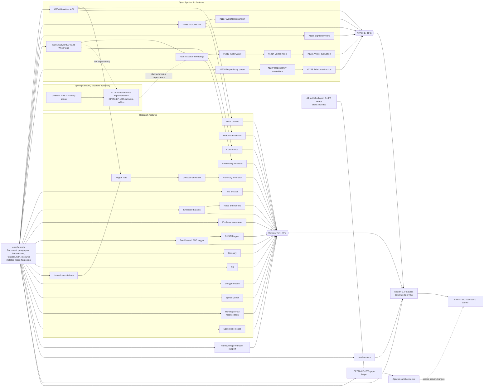

# Research branch map

Verified on 2026-09-05 using local Git history, published fork refs, Apache PR
metadata, `regen-uber.sh`, and the last generated provenance manifest.
This is the maintained map on `preview-docs`. The copy in `uber/` updates
with the next integration build.

Apache main is `34ff57bcf`. It includes Document #1182, paragraph normalization
#1249, term vectors #1212, Hunspell #1190 and #1266, CJK #1191 and #1265,
the resource installer #1211, and regex test hardening #1268. Features use
those implementations from main.

All 32 active feature branches contain this main and their required updated
parents. The current cascade uses real merges and preserves the old local and
published heads. These new merge commits are local and pending validation and
publication. The merged Hunspell and regex follow-ups are no longer separate
preview inputs.

## Integration intent and current state

- Independent features depend on current main. Dependent features use the
  updated parent branch, including main through that parent.
- `APACHE_TIPS` and `RESEARCH_TIPS` in `regen-uber.sh` define the current
  direct preview inputs. A stack tip must contain the current parent commits
  before it can substitute for those parents.
- The helper consumes published open 3.x PR heads, including drafts. Local
  research is excluded. The preview combines the selected feature branches
  and admitted research.
- The script selects 6 Apache tips and 18 research/preview tips. The stack tips
  subsume all 32 active feature branches. `--update` preserves integration
  history; `--scratch` checks a fresh detached build. Neither mode resets a
  branch or silently reuses conflict files.
- Preview regeneration and validation for this main cascade are in progress.
  The final provenance manifest records the selected heads. No current-cascade
  feature or integration commit has been pushed.
- The helper at `0bbc771ff` contains this main and all 12 current public PR
  heads. Its current validation is in progress. Apache publication remains a
  separate authorization.
- Feature fixes remain on feature branches. Integration branches are not
  sources for feature updates.

## Intended dependency tree

Solid feature arrows are verified parent relationships. Arrows into the input
groups reflect the script. Dotted arrows identify cross-repository dependencies,
planned add-on integration, or shared server changes.

```mermaid
flowchart LR
  main["apache main<br/>Document, paragraphs, term vectors,<br/>Hunspell, CJK, resource installer, regex hardening"]
  uber["kristian-3.x-features<br/>generated preview"]
  apacheTips{{"APACHE_TIPS"}}
  researchTips{{"RESEARCH_TIPS"}}

  subgraph apache["Open Apache 3.x features"]
    gaz["#1154 Gazetteer API"]
    wordnet["#1155 WordNet API"]
    expansion["#1167 WordNet expansion"]
    light["#1166 Light stemmers"]
    sentencepiece["#1165 Subword API and WordPiece"]
    static["#1152 Static embeddings"]
    turbo["#1213 TurboQuant"]
    vector["#1214 Vector index"]
    evaluation["#1215 Vector evaluation"]
    parser["#1236 Dependency parser"]
    dependency["#1237 Dependency annotations"]
    relation["#1238 Relation extraction"]
  end

  subgraph addons["opennlp-addons, separate repository"]
    canary["OPENNLP-1924-canary-addon"]
    subwordAddon["#178 SentencePiece implementation<br/>OPENNLP-1885-subword-addon"]
    canary --> subwordAddon
  end

  subgraph research["Research features"]
    artifacts["Text artifacts"]
    assets["Embedded assets"]
    noise["Noise annotations"]
    predicates["Predicate annotators"]
    ffpos["Feedforward POS tagger"]
    bilstm["BiLSTM tagger"]
    glossary["Glossary"]
    pii["PII"]
    coref["Coreference"]
    numeric["Numeric annotations"]
    region["Region vote"]
    geocode["Geocode annotator"]
    hierarchy["Hierarchy annotator"]
    profiles["Place profiles"]
    embedding["Embedding annotator"]
    symbols["Symbol joiner"]
    morfologik["Morfologik FSA<br/>reconciliation"]
    dehyphenation["Dehyphenation"]
    recase["Spellcheck recase"]
    wordnetExtension["WordNet extension"]
  end

  major0["Preview major-0 model support"]
  previewDocs["preview-docs"]
  publishedPrs["All published open 3.x PR heads<br/>drafts included"]
  helper["OPENNLP-1833-grpc-helper"]
  apacheServer["Apache sandbox server"]
  demoServer["Search and uber-demo server"]

  main --> gaz
  main --> wordnet --> expansion
  main --> light
  main --> sentencepiece --> static --> turbo --> vector --> evaluation
  main --> parser --> dependency --> relation
  sentencepiece -. API dependency .-> subwordAddon
  subwordAddon -. planned module dependency .-> static

  main --> artifacts
  main --> assets --> noise
  main --> predicates
  main --> ffpos --> bilstm
  main --> glossary
  main --> pii
  sentencepiece --> coref
  main --> numeric --> region --> geocode --> hierarchy
  gaz --> region
  gaz --> profiles
  static --> embedding
  main --> dehyphenation
  main --> symbols
  main --> morfologik
  main --> recase
  wordnet --> wordnetExtension
  main --> major0
  main --> previewDocs

  gaz --> apacheTips
  wordnet --> apacheTips
  expansion --> apacheTips
  light --> apacheTips
  evaluation --> apacheTips
  relation --> apacheTips

  artifacts --> researchTips
  assets --> researchTips
  noise --> researchTips
  predicates --> researchTips
  ffpos --> researchTips
  bilstm --> researchTips
  glossary --> researchTips
  pii --> researchTips
  coref --> researchTips
  hierarchy --> researchTips
  profiles --> researchTips
  embedding --> researchTips
  symbols --> researchTips
  recase --> researchTips
  morfologik --> researchTips
  dehyphenation --> researchTips
  wordnetExtension --> researchTips
  major0 --> researchTips

  main --> uber
  apacheTips --> uber
  researchTips --> uber
  previewDocs --> uber
  main --> helper
  publishedPrs --> helper
  helper --> apacheServer
  uber --> demoServer
  apacheServer -. shared server changes .-> demoServer
```

## Open Apache 3.x pull requests

“PR source” identifies the repository containing the PR head, not the PR
destination. “Main missing” counts main commits not reachable from the local
head. A PR marked Ready is not necessarily approved or validated for merge.

| PR / feature | Published base | PR source | Published head | Local head | Main missing | Review state | Preview input |
| --- | --- | --- | --- | --- | --- | --- | --- |
| [#1152](https://github.com/apache/opennlp/pull/1152) Static embeddings | `OPENNLP-1885-sentencepiece` | ai-pipestream | `00082f1926` | `048c058ed8` | 0 | Draft | Via #1215 |
| [#1154](https://github.com/apache/opennlp/pull/1154) Gazetteer API | `main` | ai-pipestream | `0e9e307522` | `c246d86620` | 0 | Draft | Direct |
| [#1155](https://github.com/apache/opennlp/pull/1155) WordNet API | `main` | ai-pipestream | `ff2ce79c51` | `7616812cc6` | 0 | Draft | Direct |
| [#1165](https://github.com/apache/opennlp/pull/1165) Subword API and WordPiece | `main` | ai-pipestream | `d130e1cd6e` | `d85402cc8c` | 0 | Ready | Via #1215 |
| [#1166](https://github.com/apache/opennlp/pull/1166) Light stemmers | `main` | ai-pipestream | `d7588618cc` | `192d9d314f` | 0 | Draft | Direct |
| [#1167](https://github.com/apache/opennlp/pull/1167) WordNet expansion | `main` | ai-pipestream | `acb88dfc84` | `ef88b0bf56` | 0 | Draft | Direct |
| [#1213](https://github.com/apache/opennlp/pull/1213) TurboQuant | `main` | ai-pipestream | `b2de78f059` | `579cf59eba` | 0 | Draft | Via #1215 |
| [#1214](https://github.com/apache/opennlp/pull/1214) Vector indexes | `main` | ai-pipestream | `e6ef66e5c9` | `8ad3204255` | 0 | Draft | Via #1215 |
| [#1215](https://github.com/apache/opennlp/pull/1215) Vector evaluation | `main` | ai-pipestream | `d2186aa091` | `cc397113c1` | 0 | Draft | Direct stack tip |
| [#1236](https://github.com/apache/opennlp/pull/1236) Dependency parser | `main` | apache | `5cc405820d` | `266b6d4196` | 0 | Ready | Via #1238 |
| [#1237](https://github.com/apache/opennlp/pull/1237) Dependency annotations | `OPENNLP-547-dependency-parser` | apache | `75bf330a26` | `b966af7f08` | 0 | Draft | Via #1238 |
| [#1238](https://github.com/apache/opennlp/pull/1238) Relation extraction | `OPENNLP-1919-dependency-annotations` | apache | `9c860c3afc` | `3ae7526dff` | 0 | Draft | Direct stack tip |

Fork publication alone does not update #1236, #1237, or #1238: their PR source
branches are on apache/opennlp. Keep fork synchronization and Apache PR
publication separate.

Static embeddings and its descendants contain the current subword API and
WordPiece implementation. `BertTokenizer` is removed. The in-repository
SentencePiece implementation remains tested and available until migration to
the add-on dependency is complete. That migration is separate from branch
synchronization.

Add-ons #178 is a draft at `b9a57b3dc7`, based on
`OPENNLP-1924-canary-addon`, not add-ons main. It is a separate repository
dependency, not an OpenNLP Git parent.

Separate-repository work is not part of this OpenNLP cascade. The add-ons
canary `0f36b7c36` is published with DocBook documentation, naming changes,
and release checks. Draft #178 still needs that updated base and the matching
module/manual changes. The earlier sandbox audit found two commits missing
from its own main `f1cafcf5`, and three Apache-server development commits
missing from the uber-server line. Those server refs need a fresh audit before
work resumes. No add-ons or sandbox branch was changed during this cascade.

Hunspell #1266 is merged and its final review approved the corrections.
The implementation uses the ResourceInstaller from #1211.
[OPENNLP-1927](https://issues.apache.org/jira/browse/OPENNLP-1927) tracks
remaining Hunspell compatibility and strict-loading work. It does not change
the behavior carried by this synchronization. The review also requested
separate release-note tracking for the corrections already merged in #1266.

The original Hunspell and CJK worktrees contain uncommitted edits requiring
comparison with the merged implementations. Exclude them from bulk publication
or deletion until that comparison is complete. The merged downloader worktree
was removed after preserving its commits in a verified recovery bundle.
Review checkouts, backup refs, `deregex`, and unrelated maintenance branches
are outside this feature inventory; do not include them in a bulk push.

## Research worktrees

All 20 research branches contain their existing fork heads and current main.
Their new main-sync commits are not yet pushed. Tracked working files are clean; temporary untracked feature READMEs remain local and unchanged.
The hierarchy tip contains current numeric, gazetteer, region, and geocode heads.

| Branch | Local head | Main missing | Preview input | Intended dependency | Fork status |
| --- | --- | --- | --- | --- | --- |
| `OPENNLP-XXXX-bilstm-tagger` | `0d1dba6be8` | 0 | Direct | Feedforward tagger | Main sync pending push |
| `OPENNLP-XXXX-coref` | `1cc9ea7f43` | 0 | Direct | #1165 subword API for the optional ONNX adapter | Main sync pending push |
| `OPENNLP-XXXX-dehyphenation` | `38ea9a9a8b` | 0 | Direct | main (term vectors included) | Main sync pending push |
| `OPENNLP-XXXX-embedded-assets` | `c7fa05d51e` | 0 | Direct | main | Main sync pending push |
| `OPENNLP-XXXX-embedding-annotator` | `a785b1fadb` | 0 | Direct | #1152 static embeddings | Main sync pending push |
| `OPENNLP-XXXX-ff-postagger` | `d6429bd008` | 0 | Direct | main | Main sync pending push |
| `OPENNLP-XXXX-geocode-annotator` | `0a4ea3ed3d` | 0 | Via hierarchy tip | Region vote | Main sync pending push |
| `OPENNLP-XXXX-glossary` | `841ae2fb0f` | 0 | Direct | main | Main sync pending push |
| `OPENNLP-XXXX-hierarchy-annotator` | `1921a15f75` | 0 | Direct | Geocode annotator | Main sync pending push |
| `OPENNLP-XXXX-morfologik-fsa` | `45691be18d` | 0 | Direct | main; reconcile existing extension | Main sync pending push |
| `OPENNLP-XXXX-noise` | `e686aced4f` | 0 | Direct | Embedded assets | Main sync pending push |
| `OPENNLP-XXXX-numeric` | `9597333613` | 0 | Via hierarchy tip | main | Main sync pending push |
| `OPENNLP-XXXX-pii` | `742076fa22` | 0 | Direct | main | Main sync pending push |
| `OPENNLP-XXXX-place-profiles` | `f996cc55ca` | 0 | Direct | #1154 gazetteer | Main sync pending push |
| `OPENNLP-XXXX-predicate-annotators` | `9072270c4f` | 0 | Direct | main | Main sync pending push |
| `OPENNLP-XXXX-region-vote` | `55d5ebdb4b` | 0 | Via hierarchy tip | Numeric + #1154 gazetteer | Main sync pending push |
| `OPENNLP-XXXX-spellcheck-recase` | `ad00ff5ecc` | 0 | Direct | main | Main sync pending push |
| `OPENNLP-XXXX-symbol-joiner` | `b9a246c306` | 0 | Direct | main | Main sync pending push |
| `OPENNLP-XXXX-text-artifacts` | `8499ffe5c4` | 0 | Direct | main | Main sync pending push |
| `OPENNLP-XXXX-wordnet-extension` | `de001a157f` | 0 | Direct | #1155 WordNet | Main sync pending push |

## Verified stacks

- Subword API -> static embeddings -> TurboQuant -> vector index -> evaluation.
  The embedding annotator contains current static embeddings.
- Subword API -> coreference, for its optional ONNX token-vector adapter.
  The resolver and trained models are unchanged by this compatibility update.
- Parser -> dependency annotations -> relation extraction.
- WordNet API -> expansion and research extension.
- Embedded assets -> noise; feedforward POS -> BiLSTM.
- Numeric and gazetteer -> region vote -> geocode -> hierarchy.
  Place profiles contains current gazetteer.

The TurboQuant cascade carries double-precision analogy queries through its
internal adapters. The WordNet extension carries the parent's stream ownership,
definition retention, and malformed-input checks without removing composition.

`preview-docs` and `preview-accept-major0-models` also contain current main and
their old fork heads. They are support branches, outside the 32-feature count.

## Add-ons candidates

This is a routing list, not an Apache consensus decision. Document container, term
vectors, Hunspell stemming, CJK lattice tokenization, and the resource
installer are already in core. The remaining narrow core candidates are the
subword API and WordPiece (#1165) and the dependency parser (#1236).

| Family | Candidate add-ons |
| --- | --- |
| Subwords | The concrete SentencePiece implementation is already separated as `subword-addon` in add-ons PR #178. |
| Embeddings and vector search | Static embeddings (#1152), TurboQuant (#1213), vector indexes (#1214), vector evaluation (#1215), and the embedding annotator. |
| Gazetteers and geocoding | The concrete geocoder from #1154, place profiles, numeric and region voting, geocoding, and hierarchy annotation. |
| WordNet | Readers and expansion from #1155 and #1167, plus the research WordNet extension. |
| Taggers | Feedforward and BiLSTM POS taggers. |
| Document analysis | Coreference, dehyphenation, glossary, PII, predicate, dependency-layer (#1237), and relation extraction (#1238) annotators. |
| Text preparation | Embedded assets, noise cleanup, spellcheck recasing, symbol joining, and text-artifact normalization. |
| Stemming | The light stemmers in #1166 fit the existing `Stemmer` contract and can be delivered as add-ons. |

If one of these implementations exposes a missing contract needed by several
modules, only that small contract is a core candidate. The Morfologik FSA
branch is reconciliation work against the existing extension, not a new add-on
to publish.

## Publication plan

Preserve existing local and published commits. Synchronization does not require
rewriting the feature branches.

1. Capture local and remote heads and preserve uncommitted files before updates.
2. Compare local-only and remote-only changes, including equivalent changes
   from earlier rebases. Resolve meaningful differences; do not select an entire
   side of a conflict without review.
3. Merge the existing fork history and current main into independent branches.
   Update dependent branches by merging the reconciled current parents, in
   dependency order. The downloader from main remains the implementation.
4. Check that the old local head, old fork head, current main, and required
   parent heads are ancestors of the result. Run feature tests, the affected
   package/manual build, and the pre-push review.
5. Push tested results to the existing fork branch names with normal
   fast-forward pushes. Fetch and reconsider if a remote advances.
6. Update helper and uber after the feature cascade, preserving their old
   local and published histories. Compare with a fresh scratch integration
   before publishing the preview.

The current OpenNLP main cascade is local. Feature ancestry checks are complete;
helper and preview validation is in progress. Final hashes and test logs belong
in the workspace `QUALITY-PASS.md`. Pending publication and separate-repository
work is in `TODO/BRANCH-PUBLICATION.md`. No Apache branch or PR review state
changed.

JIRA tracking, add-on migration, Apache branch updates, and PR publication remain
separate actions. Research can be backed up to the fork without changing
graduation status.
