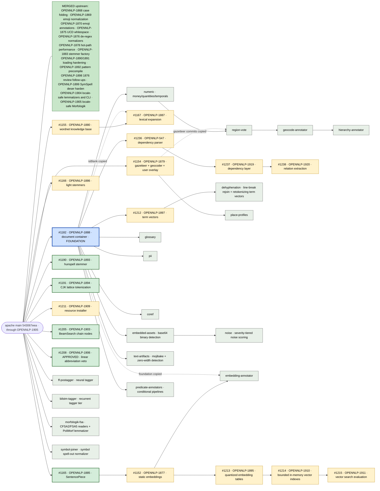

# Research branch map

This fork's layout: `main` mirrors `apache/opennlp` main exactly and never
diverges, keeping the fork a clean base for upstream work;
`kristian-3.x-features` is the research arm and the default branch, a
regenerated integration line that merges every open pull request head and every
admitted feature branch. Each build records its exact inputs in
`PIPESTREAM-PROVENANCE.txt`, and artifacts publish only as the
`ai.pipestream:opennlp-*:0.1.0-alpha4-SNAPSHOT` Maven snapshot. Everything else
is one feature per branch, stacked on its true dependency. Feature branches may
be numerous and unvetted; a branch joins the research arm through a pull request
based on `kristian-3.x-features`, whose merge adds it to the regeneration list.
Nothing ever merges out of the research arm, and none of this touches the
upstream project's own process. Read the warning at the top of
[README.md](README.md) before using anything here.

State below is as of 2026-08-21, measured against apache main `ea2ec5350`.
On August 21 the dependency parser, its typed Document adapter, and dependency-path
relation extraction moved from staged research branches to the draft pull request
stack #1236, #1237, and #1238.
On August 17 draft #1211 was hardened per the #1191 review threads (required
remote checksums, no-overwrite promotion, entry ceilings with startup
overrides), and on August 18 it was stacked on #1190 and #1191 with convergence
commits that delete their per-PR download code; #1211 is out of draft. On
August 19 the rung metaphor was retired: the sandbox gRPC surface renamed it to
Normalizer end to end, and apache branch OPENNLP-1916-minor-normalizer-fix
(in the regeneration list until it merges to main) carries the wording fix
plus a fail-loud, defensively copied aggregate normalizer chain.
Every admitted tip received a fleet-wide review pass to the krickert-review
standard. The August 10 maturity round surveyed every family, fixed defects
test-first, extended tests and manual examples, and re-cascaded children onto
their changed parents. OPENNLP-1895-turboquant was admitted to the research arm
that day and is now draft #1213, followed by draft #1214 for the bounded
in-memory index and draft #1215 for its evaluation harness. The August 11
rounds completed the PII roadmap, hardened numeric and
repaired its geo stack, completed embedded-assets and text-artifacts, recascaded
noise, and regenerated the research arm. On August 13, #1206 and #1207 merged
into Apache main, while #1208 remains approved and open. Also on August 13,
the resource installer was renamed to `OPENNLP-1909-resource-installer` and
proposed upstream as draft #1211; on August 15 the term vector layer went
upstream as draft #1212 after a review round (null-span-element validation,
final annotator, shared test fixture, supplementary-plane offset pin). The
glossary branch has three additional
local loader commits. Both tips are newer than the current published preview. Exact
integrated tips remain in `PIPESTREAM-PROVENANCE.txt`; the currently published
generated tip is `3b441fdee`. Round details and measurements remain in the
workspace-level `QUALITY-PASS.md`.

## Merge strategy

Solid arrows are the verified git base of each branch. Dashed arrows are commits a branch carries as copies of another branch's work so it compiles standalone; the copies drop automatically (by patch id) when the parent lands and the branch rebases. Staged branches are renamed to their real JIRA keys before any upstream promotion.

```mermaid
flowchart LR
  main(["apache main 543067eea · through OPENNLP-1905"])

  merged["MERGED upstream: OPENNLP-1868 case folding · OPENNLP-1869 emoji normalization<br/>OPENNLP-1870 emoji annotations · OPENNLP-1875 UCD whitespace · OPENNLP-1876 de-regex normalizers<br/>OPENNLP-1878 hot-path performance · OPENNLP-1883 stemmer factory<br/>OPENNLP-1890/1891 loading hardening · OPENNLP-1892 pattern precompile<br/>OPENNLP-1898 1876 review follow-ups · OPENNLP-1899 SymSpell deser harden<br/>OPENNLP-1904 locale-safe lemmatizers and CLI · OPENNLP-1905 locale-safe Morfologik"]
  main --- merged

  %% ---- open pull requests against apache/opennlp ----
  main --> p1182["#1182 · OPENNLP-1888 · document container · FOUNDATION"]
  main --> d1154["#1154 · OPENNLP-1879 · gazetteer + geocoder + user overlay"]
  main --> d1155["#1155 · OPENNLP-1880 · wordnet knowledge base"]
  d1155 --> d1167["#1167 · OPENNLP-1887 · lexical expansion"]
  p1182 -. isBlank copied .-> d1167
  main --> d1166["#1166 · OPENNLP-1886 · light stemmers"]
  main --> d1165["#1165 · OPENNLP-1885 · SentencePiece"]
  d1165 --> d1152["#1152 · OPENNLP-1877 · static embeddings"]
  d1152 --> p1213["#1213 · OPENNLP-1895 · quantized embedding tables"]
  p1213 --> p1214["#1214 · OPENNLP-1910 · bounded in-memory vector indexes"]
  p1214 --> p1215["#1215 · OPENNLP-1911 · vector search evaluation"]
  main --> huns["#1190 · OPENNLP-1893 · hunspell stemmer"]
  main --> cjk["#1191 · OPENNLP-1894 · CJK lattice tokenization"]
  main --> p1211["#1211 · OPENNLP-1909 · resource installer"]

  %% ---- open fix pull requests against apache/opennlp ----
  main --> p1205["#1205 · OPENNLP-1903 · BeamSearch chain nodes"]
  main --> p1208["#1208 · OPENNLP-1906 · APPROVED · linear abbreviation veto"]

  p1182 --> p1212["#1212 · OPENNLP-1897 · term vectors"]
  p1182 --> p1236["#1236 · OPENNLP-547 · dependency parser"]
  p1236 --> p1237["#1237 · OPENNLP-1919 · dependency layer"]
  p1237 --> p1238["#1238 · OPENNLP-1920 · relation extraction"]

  %% ---- staged engines (this fork only) ----
  main --> fftag["ff-postagger · neural tagger"]
  main --> bilstm["bilstm-tagger · recurrent tagger tier"]
  main --> morf["morfologik-fsa · CFSA2/FSA5 readers + PoliMorf lemmatizer"]
  main --> sjoin["symbol-joiner · symbol spell-out normalizer"]
  p1212 --> dehyp["dehyphenation · line-break rejoin + retokenizing term vectors"]
  d1154 --> prof["place-profiles"]

  %% ---- staged annotators over the document container ----
  p1182 --> glos["glossary"]
  p1182 --> pii["pii"]
  p1182 --> coref["coref"]
  p1182 --> num["numeric · money/quantities/temporals"]

  %% ---- text-hygiene pack over the document container ----
  p1182 --> tart["text-artifacts · mojibake + zero-width detection"]
  p1182 --> asset["embedded-assets · base64 binary detection"]
  asset --> noiz["noise · severity-tiered noise scoring"]
  p1182 --> pred["predicate-annotators · conditional pipelines"]

  d1152 --> emb["embedding-annotator"]
  p1182 -. foundation copied .-> emb

  num --> rvote["region-vote"]
  d1154 -. gazetteer commits copied .-> rvote
  rvote --> geo["geocode-annotator"]
  geo --> hier["hierarchy-annotator"]

  classDef mergedC fill:#c8e6c9,stroke:#1b5e20,color:#000;
  classDef ready fill:#d4edda,stroke:#1b5e20,color:#000,stroke-width:2px;
  classDef draft fill:#fff2cc,stroke:#b8860b,color:#000;
  classDef foundation fill:#cfe2ff,stroke:#1c4fb3,color:#000,stroke-width:3px;
  classDef filed fill:#e6d9f2,stroke:#5b3a8e,color:#000,stroke-width:2px;
  classDef cut fill:#e8f0e8,stroke:#555,color:#000;

  class merged mergedC;
  class d1165,huns,cjk,p1205,p1208 ready;
  class d1152,d1154,d1155,d1166,d1167,p1211,p1212,p1213,p1214,p1215,p1236,p1237,p1238 draft;
  class p1182 foundation;
  class fftag,bilstm,morf,sjoin,dehyp,prof,glos,pii,coref,num,tart,asset,noiz,pred,geo,hier,rvote,emb cut;
```

Green nodes are non-draft pull requests, including #1208 which is explicitly marked approved; amber are drafts, blue is the document container every annotator needs (now marked ready for review), and pale green is staged in this fork only. The regeneration list also carries `preview-accept-major0-models`, a preview-line-only patch letting `BaseModel` accept the major-0 version stamps the `0.1.0-alpha*` coordinates produce; it is not a feature branch and is not drawn. `#1177` (OPENNLP-1870, emoji annotations) merged upstream on 2026-07-21 and has moved into the merged box; the EmojiFlags commits `geocode-annotator` carried as copies dropped by patch id in the 2026-08-08 cascade. `#1206` and `#1207` merged on 2026-08-13 and now arrive through apache main.

## Open pull requests against apache/opennlp

Every head below was cascaded onto `fc9824a97` on 2026-08-08 and given a
fleet-wide review pass. Status records live GitHub review state as verified on
2026-08-13. APPROVED means reviewer approval, not merge.

| PR | JIRA | What it offers | Status | Notes |
|---|---|---|---|---|
| [#1182](https://github.com/apache/opennlp/pull/1182) | OPENNLP-1888 | The document container: immutable `Document`, typed layers with positional/document scope, namespaced layer keys, adapters for the classic tools, manual chapter | Open, non-draft, review required, GitHub BLOCKED; head `689636105` | The foundation every staged annotator below builds on |
| [#1166](https://github.com/apache/opennlp/pull/1166) | OPENNLP-1886 | Sixteen UniNE light/minimal stemmer tiers | Draft, review required, GitHub BLOCKED; head `ff681b393`. The 2026-08-08 rebase dropped the 13 OPENNLP-1883 commits it used to carry, now that #1163 is upstream as one squash, leaving 3 commits of its own | Parity fixtures regenerated from the original implementations. Manual cites `LightStemmerUsageExampleTest` |
| [#1155](https://github.com/apache/opennlp/pull/1155) | OPENNLP-1880 | Lexical knowledge base seam with WN-LMF and WNDB readers and a Morphy lemmatizer | Draft, review required, GitHub BLOCKED; published head `c678d6579` | Manual: `wordnet.xml`, pinned by `WordNetUsageExampleTest`; later local WordNet work is not on this pull request |
| [#1167](https://github.com/apache/opennlp/pull/1167) | OPENNLP-1887 | Weighted lexical expansion, synset similarity, hypernym-anchored typing | Draft, review required, GitHub BLOCKED; head `fa0d25354`, stacked on #1155 | Manual expansion section cites `LexicalExpansionUsageExampleTest`. On 2026-08-08 it was restacked onto the `wordnet-api` branch proper and its five carried morfologik `formats:`/`lemmatizer:` commits were dropped; their unique review improvements were reconciled into `morfologik-fsa` first |
| [#1165](https://github.com/apache/opennlp/pull/1165) | OPENNLP-1885 | Pure-Java SentencePiece inference with exact original-text spans, plus a WordPiece encoder | Open, non-draft, review required, GitHub BLOCKED; head `45db4212d` | 6.47M pieces/s single-thread on the T5-small vocabulary, 1.42x the C++ reference measured through its Python binding. Tokenizer manual cites `SentencePieceUsageExampleTest` |
| [#1152](https://github.com/apache/opennlp/pull/1152) | OPENNLP-1877 | Static text embeddings, pure JVM | Draft, no review decision; head `f6f1bef48`, stacked on #1165 | 12.9x single-thread and about 7x peak throughput of the Python reference at 0.22x the memory (potion-base-8M, output parity asserted first). Manual cites `StaticEmbeddingUsageExampleTest`; the current tip loads self-contained Model2Vec Unigram tokenizers |
| [#1213](https://github.com/apache/opennlp/pull/1213) | [OPENNLP-1895](https://issues.apache.org/jira/browse/OPENNLP-1895) | Quantized static embedding tables at 2 to 4 bits per dimension, including packed storage, bounded loading, pooling, scoring, and the `QuantizeModel` converter | Draft; head `05398bb67`; stacks on #1152 | The 2026-08-21 cascade adapted self-contained Unigram loading to the embedding-table abstraction after merging the latest #1152 tip |
| [#1214](https://github.com/apache/opennlp/pull/1214) | [OPENNLP-1910](https://issues.apache.org/jira/browse/OPENNLP-1910) | Bounded in-memory flat-float and TurboQuant indexes behind one validation and query contract | Draft; head `8bb3e65b2`; stacks on #1213 | Intended for document-scale and small-corpus search, not a distributed search engine |
| [#1215](https://github.com/apache/opennlp/pull/1215) | [OPENNLP-1911](https://issues.apache.org/jira/browse/OPENNLP-1911) | Reproducible vector-search evaluation with exact, TurboQuant, and test-scope Lucene HNSW baselines | Draft; head `5ccb70da3`; stacks on #1214 | Full top-of-stack embeddings verification is 547 tests green with one expected HNSW runner skip |
| [#1154](https://github.com/apache/opennlp/pull/1154) | OPENNLP-1879 | Gazetteer and geocoder seam, bundled Natural Earth table, GeoNames and Overture loaders, place hierarchy, user-supplied overlay (additions, suppressions, bounding boxes) | Draft, review required, GitHub BLOCKED; head `458b53a1c` | Bring-your-own-gazetteer reference in test sources. Geocoder section cites `GeocoderUsageExampleTest` |
| [#1190](https://github.com/apache/opennlp/pull/1190) | [OPENNLP-1893](https://issues.apache.org/jira/browse/OPENNLP-1893) | Hunspell `.dic`/`.aff` affix stemmer over user-supplied dictionaries, regex-free, fail-closed | Open, non-draft, changes requested, GitHub BLOCKED; head `39b576e45` | AF aliases, NEEDAFFIX / ONLYINCOMPOUND / FORBIDDENWORD / CIRCUMFIX, compound positioning incl. German linking forms. Manual: `stemmer.xml`, pinned by `HunspellManualExampleTest`. Review pass `872272560` added `{@inheritDoc}` to the stemmer overrides |
| [#1191](https://github.com/apache/opennlp/pull/1191) | [OPENNLP-1894](https://issues.apache.org/jira/browse/OPENNLP-1894) | Viterbi lattice tokenization over user-supplied MeCab-format dictionaries (Japanese, Korean) plus a Chinese unigram segmenter | Open, non-draft, changes requested, GitHub BLOCKED; head `85cb63f50` | About 5M chars/s on real IPADIC; 392k entries load in under a second; segmentation matches the reference implementation on the cost-sensitive test sentences. Manual pinned by `LatticeUsageExampleTest`. Review pass `65579e9cd` fixed lexicon lines edged with Unicode whitespace, which previously failed to load when a line started with an ideographic space |
| [#1205](https://github.com/apache/opennlp/pull/1205) | [OPENNLP-1903](https://issues.apache.org/jira/browse/OPENNLP-1903) | `BeamSearch` keeps candidate histories as shared chain nodes instead of copying each `Sequence` per candidate, removing quadratic copying from beam decoding | Open, non-draft, review required, GitHub BLOCKED; head `e9429a0e9` | JMH benchmark for long sequences included; machine-specific numbers kept out of `BENCHMARKS.md` |
| [#1208](https://github.com/apache/opennlp/pull/1208) | [OPENNLP-1906](https://issues.apache.org/jira/browse/OPENNLP-1906) | Sentence-detector abbreviation veto made linear in document length with an abbreviation index (was quadratic) | APPROVED, open, non-draft, cleanly mergeable; head `986247a62` | Full required check matrix green |
| [#1212](https://github.com/apache/opennlp/pull/1212) | [OPENNLP-1897](https://issues.apache.org/jira/browse/OPENNLP-1897) | Document-scoped term vector layer: an immutable `TermVector` payload (term, frequency, occurrence spans in original-text coordinates) and a `TermVectorAnnotator` rolling the token layer up into per-term statistics, with pluggable term identity (as-is, per-token `CharSequenceNormalizer`, whole-document `OffsetAwareNormalizer`) and a scoring-only mode that never allocates offsets | Draft, opened 2026-08-15; stacks on #1182 and stays draft until the container lands; head `9829831e0` | 32 tests including normalization-shifted offset fidelity (whitespace collapse, eszett fold), supplementary-plane offsets, and mirror-tested manual examples in the document chapter |
| [#1211](https://github.com/apache/opennlp/pull/1211) | [OPENNLP-1909](https://issues.apache.org/jira/browse/OPENNLP-1909) | Bounded `http`, `https`, and `file` installer for user-supplied third-party resources with SHA-256 or SHA-512 verification, target-local staging, symlink-safe promotion, and a dependency-free classic, ustar, GNU, and PAX tar reader | Draft, opened 2026-08-13; head `5357f64a9` | Proposed single hardened download path the per-feature installers on #1190 and #1191 can converge on. Immutable limits cover network timeouts, redirects, downloads, archive entries, total installed bytes, and every decompressed gzip byte; base-256 tar fields are supported and sparse extensions fail loud. 120 focused tests and 1,767 runtime tests green; model-loading manual cites the end-to-end and limit examples |
| [#1236](https://github.com/apache/opennlp/pull/1236) | [OPENNLP-547](https://issues.apache.org/jira/browse/OPENNLP-547) | Dependency parser API, immutable dependency graphs, event-model and pure-Java feedforward parser tiers, CoNLL-U input, training, evaluation, and model persistence | Draft, opened 2026-08-21; temporarily stacks on #1182; head `e69d29820` | The parser does not require the Document API. The temporary base keeps the review stack linear and can move to main after #1182 merges. Manual: `dependency.xml`, pinned by `ConlluDependencyParserUsageTest` |
| [#1237](https://github.com/apache/opennlp/pull/1237) | [OPENNLP-1919](https://issues.apache.org/jira/browse/OPENNLP-1919) | Per-sentence dependency parses emitted as a typed `opennlp:dependencies` Document layer with document token indexes and graph-alignment validation | Draft, opened 2026-08-21; stacks on #1236 and #1182; head `d17b74a6b` | `dependency.xml` cites `DependencyAnnotatorPipelineTest` |
| [#1238](https://github.com/apache/opennlp/pull/1238) | [OPENNLP-1920](https://issues.apache.org/jira/browse/OPENNLP-1920) | Deterministic relation extraction over ordered entity pairs and dependency paths, with optional pivot triggers and typed entity-index references | Draft, opened 2026-08-21; stacks on #1237; head `66f74f474` | 44 relation tests green. Manual: `relation.xml`, pinned by `RelationExtractionExampleTest` |

## Staged feature branches (this fork only, not yet proposed upstream)

All staged branches are based on a recent apache main (each rebases fully before any promotion), tested at their tips, and cascaded onto `fc9824a97` with the pull-request heads on 2026-08-08, and carry `OPENNLP-XXXX-` names until their JIRA tickets are filed. The annotator branches require the #1182 document container and carry it as dropped-on-merge copies where noted in the diagram. Feature manuals cite a `*UsageExampleTest` or `*ManualExampleTest` that pins the printed programlisting; those tests are the cookbook link for each surface.

| Branch | What it offers | Status | Notes |
|---|---|---|---|
| `ff-postagger` | Feedforward neural POS tagger on the same trainer recipe, with opt-in pretrained word-vector input features and a coverage lexicon | Staged | 94.68% on UD English EWT vs 93.75% for the best classical configuration in-tree; 95.51% with the opt-in vector block (potion-base-8M vectors plus a dictionary lexicon), defaults unchanged. Manual section cites `FeedforwardPOSTaggerUsageTest` |
| `bilstm-tagger` | Bidirectional LSTM tagger tier: character BiLSTM word representations, learned plus frozen pretrained embeddings, optional stacked encoder, CRF decoding, and multi-task auxiliary training; every layer gradient-checked against finite differences | Experimental, accuracy gate pending | 96.00% on UD English EWT so far vs the 97.0% gate; active lever is pretrained-table fine-tuning. Manual section cites `BilstmPOSTaggerUsageTest` |
| `morfologik-fsa` | Clean-room readers for the morfologik CFSA2 and FSA5 automaton formats behind a shared `FsaSequenceReader`, decoding into a `DictionaryLemmatizer`, plus a PoliMorf morphological-table reader | Staged, on current main, 389 formats tests green | Split out of #1167 on 2026-07-24, where these commits were written under `formats:`/`lemmatizer:` titles with no JIRA key. Unlike `opennlp-extensions/opennlp-morfologik`, which depends on `morfologik-stemming` and `morfologik-tools`, this adds no dependency. The PoliMorf reader's `StringUtil.isBlank` call became a private helper, since that method is an OPENNLP-1888 addition absent from main. The second review pass #1167 carried over these files was reconciled back into this branch on 2026-08-08 (folded header check, truncated-header pins); #1167 no longer carries the commits |
| `place-profiles` | Metadata-grounded place similarity over user-supplied profiles | Staged, stacked on #1154 | `geo.xml` cites `PlaceProfilesUsageTest` |
| `glossary` | Exact, normalized, inflection-aware, and composite dictionary matching as a document layer, with complete UAX #29 boundaries and aligned contraction expansion | Staged, needs #1182; local tip `120f21b2a`, GitHub `cd761bfc4`, current preview `f470a25df` | Local-only follow-up adds ISO 30042 TBX 2/3 and RFC 4180 CSV readers behind `GlossaryReader`; manual listings are mirror-tested |
| `pii` | PII detection and masking layers | Staged, needs #1182 | `pii.xml` cites `PiiUsageExampleTest` |
| `coref` | Coreference chains as a document layer | Staged, needs #1182 | Document-layer section cites `CorefPipelineExampleTest` (legacy `coref.xml` unchanged) |
| `numeric` | Money, quantities, absolute and relative temporals, and document-date layers with US/EU notation, spelled-out currencies, packs, and region-aware currency resolution | Staged, needs #1182 | `numeric.xml` cites `NumericExtractionExampleTest`; false-positive corpus and JMH included |
| `text-artifacts` | Mojibake, replacement-character, zero-width, and Unicode tag artifact spans as a document layer, with per-type selection | Staged, needs #1182 | Windows-1252 and ISO-8859-1 C1 mojibake families; valid subdivision emoji tag flags excluded; `artifacts.xml` cites `ArtifactsManualExampleTest` |
| `embedded-assets` | Data URIs, bare standard and URL-safe base64, MIME/PEM wrapped payloads, RFC 7468 envelopes, and compact JWTs as exact spans with format identification from file magic, plus asset folding that keeps every offset mapped to the source | Staged, needs #1182 | Magic table covers 220 formats; strict bounded JWT header validation; `assets.xml` cites `AssetsManualExampleTest` |
| `noise` | Severity-tiered structural noise scoring as a document layer, excluding spans already explained as embedded assets | Staged, on `embedded-assets` | `noise.xml` cites `NoiseManualExampleTest` |
| `predicate-annotators` | Conditional and filtering annotator combinators for predicate-gated pipelines | Staged, needs #1182 | Document predicates section cites `PredicateManualExampleTest` |
| `region-vote` | Document-scoped region ballot: location mentions, country names, and flag emoji vote on where a document speaks from | Staged, on `numeric` | Document section cites `RegionCurrencyResolutionExampleTest` |
| `geocode-annotator` | Gazetteer-backed geocoding of location entities into a document layer | Staged, on `region-vote` | `geo.xml` pipeline cites `LocationPipelineExampleTest`. Its EmojiFlags copies dropped in the 2026-08-08 cascade now that #1177 is upstream |
| `hierarchy-annotator` | Administrative containment chains for resolved locations | Staged, on `geocode-annotator` | `geo.xml` cites `HierarchyPipelineExampleTest` |
| `embedding-annotator` | Embedding vectors for any span layer (tokens, sentences) | Staged, on #1152 | `embeddings.xml` annotator section cites `EmbeddingAnnotatorUsageTest` |
| `OPENNLP-XXXX-symbol-joiner` | Whole-token symbol spell-out normalizer (`&` to `and`, `§` to `section`, IP marks) | Staged, on main | Row in the normalizer chapter table; identity passthrough pinned by parameterized tests |
| `OPENNLP-XXXX-dehyphenation` | Line-break de-hyphenation normalizer with exact alignment, plus `RetokenizingTermVectorAnnotator` for count-changing normalizers | Staged, on OPENNLP-1897 | Normalizer chapter section cites `RetokenizingTermVectorAnnotatorTest` |

## Local candidate branches not yet admitted

These branches exist as reviewed local work but are not members of
`regen-uber.sh`, so the current preview does not contain them.

| Branch | What it offers | Status |
|---|---|---|
| `OPENNLP-XXXX-wordnet-extension` | Caller-resolved WN-LMF `LexiconExtension` composition with exact base/version matching, immutable raw-model composition, cycle and depth limits, external entry/sense/synset validation, and mirrored manual usage | Clean local tip `3a4328e46`, three commits on local WordNet parent `5f1078a3e`; 357 WordNet tests green with 3 pre-existing OMW skips; not pushed, no JIRA key, not admitted |

## The path upstream

Moving a branch to Apache OpenNLP is a separate act from admitting it to the research arm, and it follows the upstream project's process, not ours: JIRA ticket filed and the branch renamed to its key, rebase onto its final parents, upstream pull request opened when the intake queue has room to review and vet it properly, and the upstream review then judges it on the project's normal standards. Until all of that happens for a given branch, treat its content as a demo.
